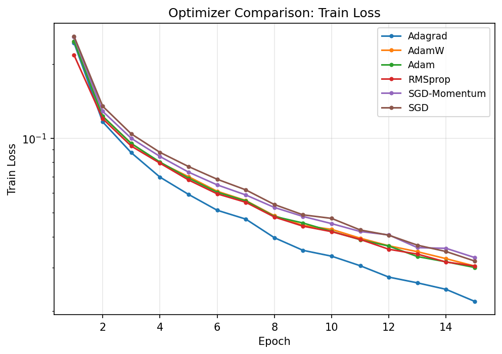
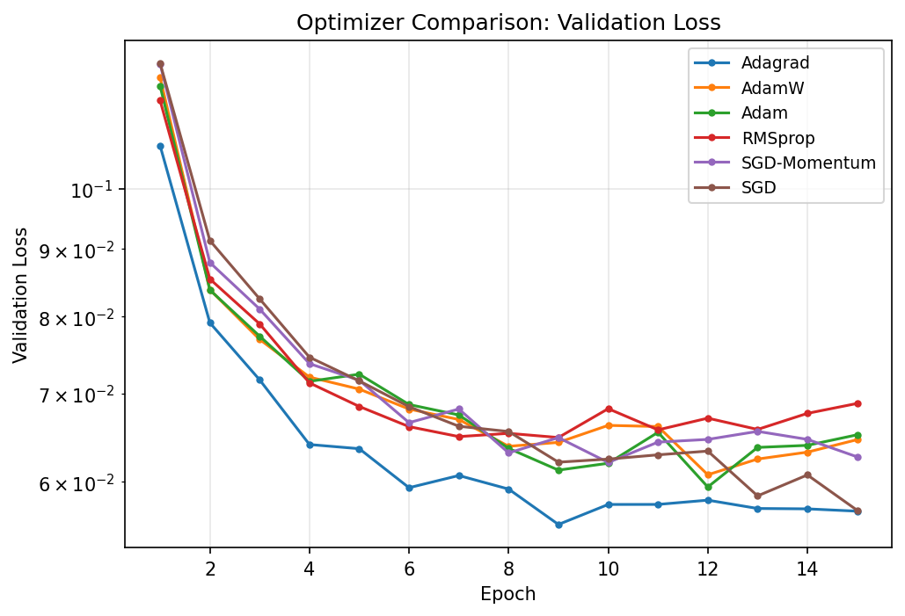
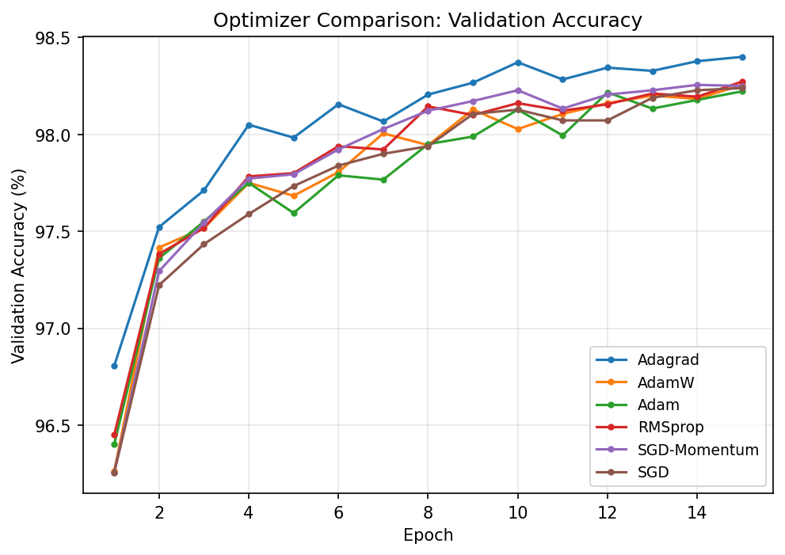
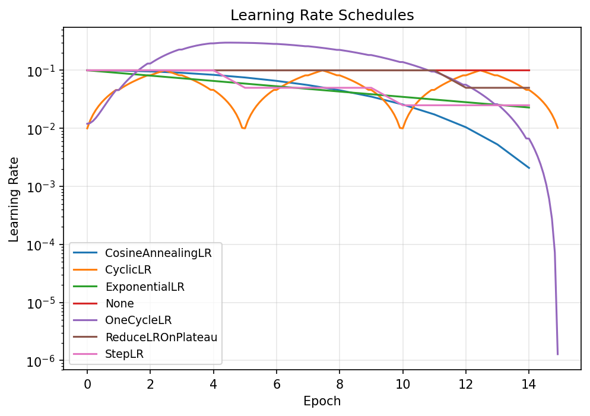
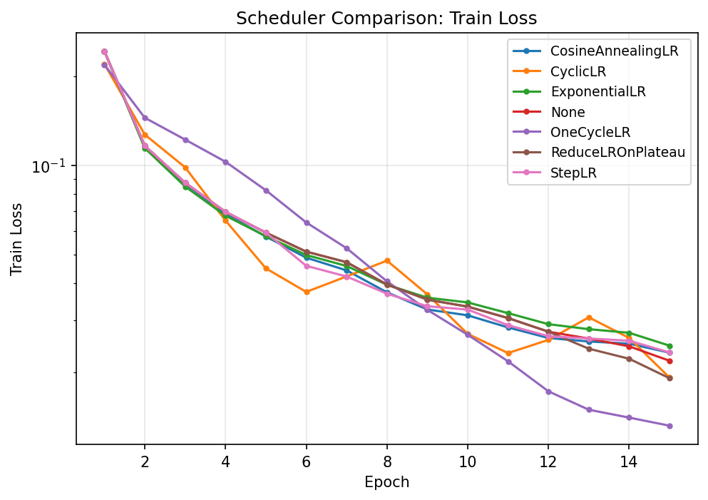
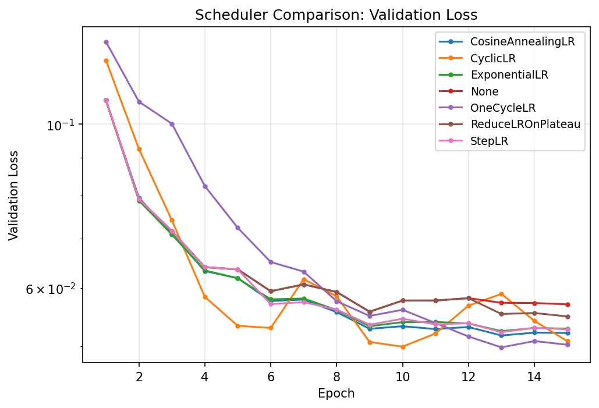
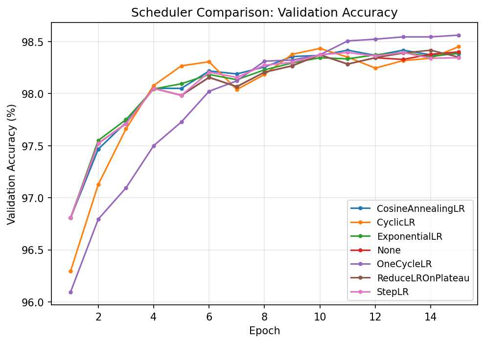
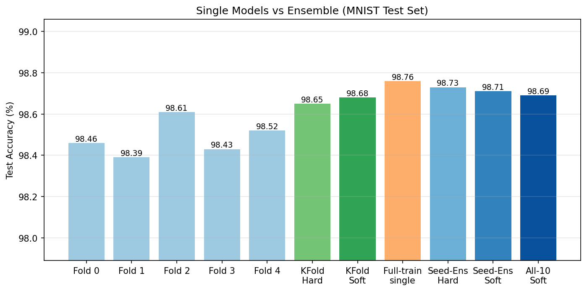
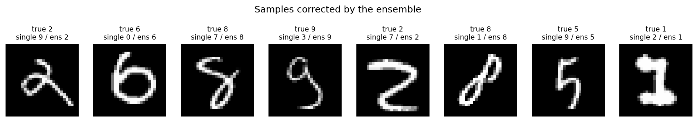
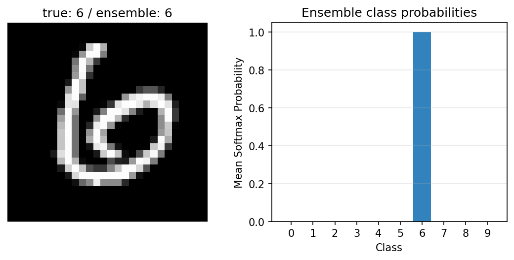

# 딥러닝기초 과제 2 — MNIST 분류 모델의 Optimization Technique, LR Scheduler, 앙상블 비교 연구

**202258096 임준현**

---

## 1. 개요

본 보고서는 MNIST 손글씨 숫자 분류 MLP 모델을 대상으로, 강의자료(`pr_14_torch_mnist_v3`) 코드를 기반으로 다음 세 가지 실험을 수행한 결과를 정리한다.

1. **Optimization Technique 비교** — 6종의 optimizer를 loss 수렴 속도와 정확도 관점에서 비교 평가하여 최우수 optimizer를 선정
2. **Learning Rate Scheduler 비교** — (1)에서 선정된 optimizer에 7종의 LR scheduler를 적용·비교하여 최우수 scheduler를 선정
3. **앙상블** — (2)의 최종 구성으로 K-Fold 앙상블과 시드 앙상블을 학습하고 단일 모델 대비 성능을 평가

모든 실험 코드는 첨부된 코드 압축파일에 포함되어 있으며, 실행 방법은 부록에 정리하였다.

## 2. 실험 환경 및 공통 설정

### 2.1 하드웨어/소프트웨어

| 항목 | 내용 |
|---|---|
| GPU | NVIDIA GeForce RTX 3070 Ti (CUDA 13.0) |
| OS | WSL2 (Ubuntu, Linux 6.6) |
| 프레임워크 | Python 3.12, PyTorch 2.12.0+cu130 |
| 기타 라이브러리 | numpy, scikit-learn (K-Fold), matplotlib |

### 2.2 데이터셋 및 전처리

- **MNIST**: 28×28 흑백 손글씨 숫자(0–9), 학습 60,000장 / 테스트 10,000장 (`mnist.npz`)
- **전처리**: 학습 데이터의 평균·표준편차로 z-정규화 (강의자료와 동일)
- **분할**: 학습 60,000장 → 학습 54,000장 / 검증 6,000장 (검증 비율 0.1)
  - 분할 시드를 42로 **고정**하여 모든 실험이 동일한 검증셋으로 평가되도록 함 (강의 코드의 `random_split`은 시드가 없어 실행마다 검증셋이 달라지는 문제를 보정)

### 2.3 모델 구조

강의자료 `model_v2.py`의 MLP를 모든 실험에서 동일하게 사용하였다 (optimizer/scheduler/앙상블 효과만을 비교하기 위한 통제 변인).

```
입력 784 → FC(256) → BatchNorm → ReLU → Dropout(0.2)
        → FC(256) → BatchNorm → ReLU → Dropout(0.2)
        → FC(10)                          (총 파라미터 약 27만 개)
```

### 2.4 공통 하이퍼파라미터

| 항목 | 값 |
|---|---|
| Batch size | 64 |
| Epochs | 15 (LR 탐색은 5) |
| 손실 함수 | CrossEntropyLoss |
| 검증 비율 | 0.1 (54,000 / 6,000) |
| 랜덤 시드 | 0, 1, 2 (3회 반복, 평균±표준편차 보고) |
| 데이터 분할 시드 | 42 (모든 실험 공통) |

### 2.5 실험 방법론

- **검증셋 기반 선택**: Part 1·2의 optimizer/scheduler 선택은 모두 **검증 정확도**로 수행하고, 테스트셋(10,000장)은 Part 3의 최종 평가에서만 사용하였다. 비교 과정에서 테스트셋을 반복 참조하면 테스트 성능이 선택 과정에 누설(leakage)되어 일반화 성능을 과대평가하게 되기 때문이다.
- **시드 반복**: 같은 구성을 시드 3개(0, 1, 2)로 반복해 평균±표준편차를 보고함으로써 우연한 초기화 차이에 의한 결론 오류를 방지하였다.
- **수렴 속도 지표**: loss 곡선과 함께, (a) 검증 정확도 97% 최초 도달 epoch, (b) 학습 loss 0.1 이하 최초 도달 epoch, (c) epoch당 학습 시간을 정량 지표로 사용하였다.

## 3. Optimization Technique 비교 (Part 1)

### 3.1 비교 대상

강의자료에서 다룬 5종에 최신 기법 1종(AdamW)을 추가하여 총 6종을 비교하였다.

| Optimizer | 특징 |
|---|---|
| SGD | 기본 확률적 경사하강법 |
| SGD-Momentum | 관성항(momentum=0.9)으로 진동을 줄이고 가속 |
| Adagrad | 파라미터별 누적 기울기 제곱으로 학습률을 적응적으로 감쇠 |
| RMSprop | 누적 대신 지수이동평균(alpha=0.99)으로 Adagrad의 학습률 소멸 문제 완화 |
| Adam | RMSprop + momentum (1차·2차 모멘트 추정) |
| AdamW | Adam + 분리된 weight decay(0.01) 정규화 |

### 3.2 학습률 탐색

동일한 학습률(예: 강의 기본값 1e-2)을 모든 optimizer에 일괄 적용하면 적응형 계열(Adam 등)에 불리한 불공정 비교가 된다.
따라서 optimizer별로 학습률 3개를 5 epoch씩 탐색한 뒤, **각자의 최적 학습률로 본 비교**를 수행하였다.

| Optimizer | LR | Best Val Acc (%) | Final Val Acc (%) | 선택 |
|---|---|---|---|---|
| SGD | 0.1 | 97.72 | 97.72 | ✓ |
| SGD | 0.01 | 96.37 | 96.37 |  |
| SGD | 0.001 | 91.10 | 91.10 |  |
| SGD-Momentum | 0.1 | 97.93 | 97.93 | ✓ |
| SGD-Momentum | 0.01 | 97.62 | 97.62 |  |
| SGD-Momentum | 0.001 | 96.47 | 96.47 |  |
| Adagrad | 0.1 | 98.03 | 98.03 | ✓ |
| Adagrad | 0.01 | 97.85 | 97.85 |  |
| Adagrad | 0.001 | 95.05 | 95.05 |  |
| RMSprop | 0.01 | 97.73 | 97.73 |  |
| RMSprop | 0.001 | 97.77 | 97.77 | ✓ |
| RMSprop | 0.0001 | 97.25 | 97.25 |  |
| Adam | 0.01 | 97.62 | 97.33 |  |
| Adam | 0.001 | 97.83 | 97.82 | ✓ |
| Adam | 0.0001 | 97.30 | 97.30 |  |
| AdamW | 0.01 | 97.38 | 97.35 |  |
| AdamW | 0.001 | 97.88 | 97.83 | ✓ |
| AdamW | 0.0001 | 97.27 | 97.27 |  |

탐색 결과는 교과서적 경향과 일치한다. SGD 계열은 큰 학습률(0.1)이 필요한 반면(0.001에서는 15 epoch 내 수렴 불가), 적응형 계열은 1e-3 부근이 최적이며 1e-2에서는 오히려 학습이 불안정해진다(Adam의 경우 best 97.62% 대비 final 97.33%로 후반 진동).

### 3.3 본 비교 결과

각 optimizer를 최적 학습률로 15 epochs × 3 seeds 학습한 결과이다 (검증 정확도 내림차순).

| Optimizer | LR | Final Val Acc (%) | Best Val Acc (%) | Final Val Loss | Val Acc≥98.0% 도달 epoch | Train Loss≤0.05 도달 epoch | sec/epoch |
|---|---|---|---|---|---|---|---|
| **Adagrad** | **0.1** | **98.40 ± 0.08** | **98.44 ± 0.04** | **0.0570** | **4.7 (3/3)** | **7.0 (3/3)** | 2.1 |
| RMSprop | 0.001 | 98.27 ± 0.01 | 98.33 ± 0.03 | 0.0688 | 6.0 (3/3) | 8.0 (3/3) | 2.1 |
| AdamW | 0.001 | 98.26 ± 0.07 | 98.32 ± 0.05 | 0.0646 | 7.7 (3/3) | 8.0 (3/3) | 2.1 |
| SGD-Momentum | 0.1 | 98.25 ± 0.02 | 98.32 ± 0.04 | 0.0627 | 7.0 (3/3) | 9.0 (3/3) | 2.0 |
| SGD | 0.1 | 98.24 ± 0.04 | 98.27 ± 0.05 | 0.0571 | 8.3 (3/3) | 9.0 (3/3) | 1.9 |
| Adam | 0.001 | 98.22 ± 0.05 | 98.30 ± 0.06 | 0.0651 | 9.7 (3/3) | 8.0 (3/3) | 2.1 |

(도달 epoch는 시드 3개 평균이며 괄호는 도달한 시드 수. 97%/0.1 임계값은 모든 optimizer가 1~2 epoch에 도달해 변별력이 없어 98%/0.05로 상향함. sec/epoch는 첫 epoch 워밍업 제외 평균.)







### 3.4 분석 및 결론

- **정확도**: 각자 최적 학습률을 사용하면 6종 모두 98.2%대에 도달해 격차가 크지 않지만, **Adagrad가 98.40%로 1위**이며 2위 그룹(98.22~98.27%)과의 차이(+0.13%p)가 시드 간 표준편차(0.01~0.08)보다 커서 유의미하다.
- **loss 수렴 속도**: Adagrad는 검증 정확도 98% 도달까지 평균 4.7 epoch로 가장 빨랐고(2위 RMSprop 6.0), 학습 loss 0.05 도달도 7.0 epoch로 가장 빨랐다. 곡선에서도 전 구간에 걸쳐 가장 아래(loss)/위(정확도)에 위치한다.
- **해석**: Adagrad는 파라미터별 누적 기울기 제곱으로 학습률을 나누므로, 큰 초기 학습률(0.1)로 초반에 빠르게 수렴한 뒤 누적 분모가 커지며 자연스러운 학습률 감쇠(annealing) 효과를 얻는다. MNIST MLP처럼 비교적 단순한 문제 + 짧은 학습(15 epoch)에서는 Adagrad의 약점인 "학습률 소멸"이 드러나기 전에 장점만 취하게 된다. 반면 Adam 계열은 안정적이지만 보수적인 학습률(1e-3)에서 후반 미세 수렴이 상대적으로 느렸다.
- **학습 시간**: 전 optimizer가 epoch당 1.9~2.1초로 차이가 미미하여 선택 기준이 되지 않는다.

> **결론: 본 실험 조건(MLP, batch 64, 15 epochs)에서는 Adagrad(lr=0.1)가 수렴 속도와 정확도 모두에서 가장 우수한 optimizer이다.** 이후 Part 2의 scheduler 비교는 Adagrad(lr=0.1)를 기준으로 수행한다.

## 4. Learning Rate Scheduler 비교 (Part 2)

### 4.1 비교 대상 및 설정

Part 1에서 선정된 **Adagrad(lr=0.1)** 에 다음 7가지 구성을 적용하였다 (이하 L = 기준 학습률 0.1). 상수 학습률(None)을 baseline으로 두어 "scheduler를 쓰는 것이 안 쓰는 것보다 나은가"부터 검증하였다.

| Scheduler | 설정 | step 단위 |
|---|---|---|
| None (baseline) | 상수 L | — |
| StepLR | 5 epoch마다 ×0.5 | epoch |
| ExponentialLR | 매 epoch ×0.9 | epoch |
| CosineAnnealingLR | T_max=15, eta_min=L/100 | epoch |
| CyclicLR | L/10 ↔ L, 반주기 2.5 epoch, triangular | **batch** |
| ReduceLROnPlateau | 검증 loss 정체 시 ×0.5, patience=2 | epoch (val loss 기준) |
| OneCycleLR | max_lr=3L, 워밍업 후 annealing | **batch** |

강의자료 기본 설정 중 실제 학습 길이와 맞지 않는 부분은 다음과 같이 보정하였다.

- **CosineAnnealingLR**: 강의 기본값 `T_max=100`은 15 epoch 학습 시 코사인 곡선의 15%만 사용해 사실상 감쇠가 일어나지 않으므로 `T_max=epochs(15)`로 수정. `eta_min=1e-3`도 기준 학습률에 비례(L/100)하도록 변경.
- **CyclicLR**: 강의처럼 epoch 단위로 step하면 `step_size_up=50`에 도달하지 못해 주기가 동작하지 않으므로, 설계 의도대로 **batch 단위 step**으로 수정하고 반주기를 2.5 epoch(총 3주기)으로 설정.

실제 적용된 학습률 궤적은 아래와 같다 (학습 중 기록된 값, 로그 스케일).



### 4.2 결과

| Scheduler | LR | Final Val Acc (%) | Best Val Acc (%) | Final Val Loss | Val Acc≥98.0% 도달 epoch | Train Loss≤0.05 도달 epoch | sec/epoch |
|---|---|---|---|---|---|---|---|
| **OneCycleLR** | 0.1 | **98.56 ± 0.05** | **98.59 ± 0.02** | **0.0502** | 6.0 (3/3) | 8.0 (3/3) | 2.0 |
| CyclicLR | 0.1 | 98.45 ± 0.00 | 98.53 ± 0.11 | 0.0508 | **4.0 (3/3)** | **5.0 (3/3)** | 2.0 |
| None | 0.1 | 98.40 ± 0.08 | 98.44 ± 0.04 | 0.0570 | 4.7 (3/3) | 7.0 (3/3) | 2.2 |
| ExponentialLR | 0.1 | 98.39 ± 0.05 | 98.45 ± 0.02 | 0.0528 | 4.7 (3/3) | 6.7 (3/3) | 2.1 |
| CosineAnnealingLR | 0.1 | 98.38 ± 0.11 | 98.46 ± 0.06 | 0.0521 | 4.0 (3/3) | 6.0 (3/3) | 2.1 |
| ReduceLROnPlateau | 0.1 | 98.35 ± 0.02 | 98.43 ± 0.04 | 0.0549 | 4.7 (3/3) | 7.0 (3/3) | 2.1 |
| StepLR | 0.1 | 98.34 ± 0.07 | 98.44 ± 0.06 | 0.0527 | 4.7 (3/3) | 6.0 (3/3) | 2.1 |

(None 행이 Part 1의 Adagrad 결과와 정확히 일치하는 것은 동일 구성·동일 시드의 재현으로, 실험 재현성이 확보되었음을 보여준다.)







### 4.3 분석 및 결론

- **정확도**: **OneCycleLR가 98.56%로 1위**이며, baseline(None, 98.40%) 대비 +0.16%p, 2위 CyclicLR 대비 +0.11%p 우위다. 시드 간 표준편차(0.05/0.02)가 작아 우연이 아닌 일관된 효과다. 검증 정확도 곡선에서 OneCycleLR는 워밍업 구간(1~5 epoch) 동안 가장 낮다가, 학습률이 최고점(0.3)을 지나 0으로 annealing되는 11 epoch 이후 다른 모든 구성을 명확히 추월한다.
- **수렴 속도**: 초반 수렴은 CyclicLR(98% 도달 4.0 epoch, loss 0.05 도달 5.0 epoch)가 가장 빠르다. OneCycleLR는 의도된 워밍업 때문에 초반이 느리지만(6.0 epoch), 이는 큰 학습률(3L)을 안전하게 통과하기 위한 비용이며 최종 성능으로 보상된다.
- **나머지 단조 감쇠 계열**(StepLR, ExponentialLR, CosineAnnealingLR, ReduceLROnPlateau)은 baseline과 유의미한 차이가 없었다(98.34~98.39%, 표준편차 범위 내). Adagrad 자체가 누적 분모로 학습률을 이미 감쇠시키므로, 추가적인 단조 감쇠는 중복 효과에 그치는 것으로 해석된다. 반면 주기적/일회성 **상승** 구간을 가진 CyclicLR·OneCycleLR는 Adagrad가 만들지 못하는 탐색(exploration) 효과를 더해 주어 효과가 있었다.
- **최종 epoch 부근의 미세 수렴**: OneCycleLR의 최종 검증 loss(0.0502)가 가장 낮다. 학습률이 0 근처까지 내려가는 마지막 구간이 사실상 fine-tuning 역할을 한다.

> **결론: Adagrad(lr=0.1)에는 OneCycleLR(max_lr=0.3)가 가장 우수한 scheduler이다.** 최종 정확도와 최종 loss 모두 1위이고 시드 간 편차도 작다. 빠른 초기 수렴이 더 중요한 상황이라면 CyclicLR가 대안이 될 수 있다. Part 3의 앙상블은 Adagrad(lr=0.1) + OneCycleLR 구성으로 수행한다.

## 5. 앙상블 (Part 3)

### 5.1 방법

Part 1·2에서 선정된 **Adagrad(lr=0.1) + OneCycleLR(max_lr=0.3)** 구성으로 두 가지 앙상블을 구성하였다. 학습 조건은 동일하다(batch 64, 15 epochs).

- **K-Fold 앙상블** (강의 방식): 학습 데이터 60,000장을 5-Fold로 분할(shuffle, random_state=42)하고, 각 fold에서 48,000장으로 학습한 모델 5개를 결합. 나머지 12,000장은 fold별 검증에 사용.
- **시드 앙상블**: 60,000장 전체로 학습하되 랜덤 시드(초기화·배치 순서)만 달리한 모델 5개를 결합. 데이터 손실 없이 모델 다양성만 확보하는 방식.
- **결합 방식** 두 가지를 비교:
  - **Hard voting**: 각 모델의 예측 라벨 다수결, 동률 시 가장 작은 라벨 (강의자료 방식)
  - **Soft voting**: 각 모델의 softmax 확률을 평균한 뒤 argmax
- **비교 기준**: 전체 데이터로 학습한 단일 모델 (시드 앙상블의 seed0 모델과 동일)

평가는 학습에 전혀 사용하지 않은 **테스트셋 10,000장**으로 수행하였다 (본 보고서에서 테스트셋을 사용하는 유일한 단계).

### 5.2 결과

| 구성 | Test Accuracy (%) |
|---|---|
| Fold 단일 모델 5개 (평균) | 98.48 ± 0.08 (98.39~98.61) |
| K-Fold 앙상블 — Hard voting | 98.65 |
| K-Fold 앙상블 — Soft voting | 98.68 |
| Full-train 단일 모델 5개 (평균) | 98.63 ± 0.11 (98.53~98.76) |
| Full-train 단일 모델 중 최고 (seed0) | 98.76 |
| **시드 앙상블 — Hard voting** | **98.73** |
| 시드 앙상블 — Soft voting | 98.71 |
| 통합 앙상블 (fold 5 + full 5, Soft) | 98.69 |



앙상블이 단일 모델(seed0)의 오분류를 바로잡은 예시는 아래와 같다. 사람이 봐도 혼동할 만한 형태의 숫자들을 다수 모델의 합의로 복원하는 것을 확인할 수 있다.



단일 샘플 추론(`inference.py`) 예시 — 테스트 샘플 #11(정답 6)에 대해 fold 모델 5개가 모두 6을 예측(확률 0.9999~1.0000)하여 앙상블도 6으로 판정:



### 5.3 분석 및 결론

- **앙상블 효과는 일관되게 확인된다.** K-Fold 앙상블은 구성원 평균(98.48%) 대비 +0.20%p, 시드 앙상블은 구성원 평균(98.63%) 대비 +0.10%p 향상되었다. 두 경우 모두 앙상블이 구성원 중 최고 모델과 같거나 그 이상이다.
- **K-Fold보다 시드 앙상블이 우수하다** (98.68% vs 98.73%). K-Fold는 모델당 학습 데이터가 48,000장으로 20% 줄어드는 비용을 치르는 반면, 시드 앙상블은 전체 데이터를 유지한 채 초기화·배치 순서의 무작위성만으로 다양성을 확보하기 때문이다. 같은 이유로 약한 fold 모델들을 섞은 통합 앙상블(98.69%)도 시드 앙상블보다 낮았다 — 앙상블은 멤버 수보다 멤버의 질이 중요하다.
- **단일 최고 모델(98.76%)과의 비교는 해석에 주의가 필요하다.** seed0 모델이 앙상블(98.73%)보다 0.03%p(3개 샘플) 높지만, 이는 테스트 결과를 보고 사후적으로 최고 시드를 고른 값이다. 단일 모델 성능은 시드에 따라 98.53~98.76%로 출렁이므로(σ=0.11), 사전적으로 기대할 수 있는 단일 모델 성능은 98.63%다. 앙상블은 이 복권 추첨을 **안정적인 98.7%대**로 바꿔 준다 — 즉 앙상블의 실질 가치는 평균 성능 향상과 **분산 감소(신뢰성)** 에 있다.
- **Hard vs Soft voting**: 차이가 0.02~0.03%p(10,000장 중 2~3장)로 사실상 동률이다. 이론적으로는 soft voting이 확신도 정보를 활용해 유리하지만, 멤버들이 이미 매우 정확하고 서로 강하게 일치하는 본 실험에서는 차이가 드러나지 않았다.

> **결론: Adagrad(lr=0.1) + OneCycleLR 구성의 시드 앙상블(5개 모델, hard voting)이 테스트 정확도 98.73%로 최종 최고 성능을 달성했다.** 앙상블은 구성원 평균 대비 일관된 정확도 향상과 시드 운에 좌우되지 않는 안정성을 제공하며, 데이터를 분할하는 K-Fold 방식보다 전체 데이터 + 시드 다양화 방식이 더 효과적이었다.

## 6. 종합 결론

세 단계의 실험을 통해 MNIST 분류 MLP의 성능을 단계적으로 끌어올렸다.

| 단계 | 구성 | 성능 |
|---|---|---|
| Part 1 | **Adagrad(lr=0.1)** 선정 (6종 중 1위) | 검증 정확도 98.40% |
| Part 2 | + **OneCycleLR(max_lr=0.3)** 선정 (7종 중 1위) | 검증 정확도 98.56% (+0.16%p) |
| Part 3 | + **시드 앙상블 (5모델, hard voting)** | **테스트 정확도 98.73%** (단일 모델 평균 98.63% 대비 +0.10%p) |

1. **Optimizer**: 공정한 비교를 위해 optimizer별 최적 학습률을 먼저 탐색한 뒤 비교한 결과, **Adagrad(lr=0.1)** 가 최종 검증 정확도(98.40%)와 수렴 속도(98% 도달 4.7 epoch) 모두 1위였다. 적응형 학습률의 자연 감쇠 효과가 짧은 학습에 특히 유리했다.
2. **Scheduler**: 단조 감쇠 계열(StepLR, ExponentialLR, CosineAnnealing, Plateau)은 baseline과 차이가 없었던 반면, 학습률 상승 구간을 가진 **OneCycleLR**(98.56%)와 CyclicLR(98.45%)만이 유의미한 향상을 보였다. Adagrad가 이미 학습률을 감쇠시키므로, scheduler는 감쇠의 중복이 아니라 탐색(상승) 기회를 더해줄 때 효과가 있었다.
3. **앙상블**: 시드 앙상블이 K-Fold 앙상블보다 우수했고(98.73% vs 98.68%), 두 방식 모두 구성원 평균 대비 일관된 향상을 보였다. 앙상블의 핵심 가치는 최고치 경신보다 시드 운에 따른 성능 변동(98.53~98.76%)을 안정적인 98.7%대로 수렴시키는 **신뢰성**에 있다.

종합하면, **"optimizer별 최적 학습률 탐색 → Adagrad + OneCycleLR → 시드 앙상블"** 의 조합이 본 과제의 최종 권장 구성이며, 테스트 정확도 98.73%를 달성하였다.

**한계 및 향후 과제**: 본 실험은 모델 구조를 MLP로 고정하고 최적화 기법만 비교했다. CNN 등 구조 개선을 병행하면(강의자료 pr_15) 99% 이상 도달이 가능할 것으로 예상되며, optimizer-scheduler 상호작용(예: Adam+OneCycle 조합 재탐색)도 추가 탐구 가치가 있다.

## 부록: 코드 구조 및 실행 방법

### A.1 코드 구조

제출 압축파일의 구성은 다음과 같다. 강의자료 `pr_14_torch_mnist_v3`의 코드를 기반으로 하되, 주석 토글 방식 대신 설정 기반 실험 러너로 재구성하였다.

| 파일 | 역할 |
|---|---|
| `data_loader.py` | MNIST 로드, z-정규화, train/val 분할(시드 42 고정) |
| `model.py` | MLP(784-256-256-10, BatchNorm+Dropout) — 강의 `model_v2.py`와 동일 |
| `engine.py` | 공용 학습/평가 루프 (epoch/batch/plateau scheduler step 모드 지원) |
| `configs.py` | 공통 하이퍼파라미터·optimizer/scheduler 정의·최종 선택 구성(BEST) |
| `run_experiments.py` | Part 1·2 실험 러너 (run별 JSON, summary 표, 곡선 자동 생성) |
| `plotting.py` | 비교 곡선 시각화 |
| `train.py` | **Part 3 학습**: 5-Fold 앙상블 + full-train 단일 모델 |
| `test.py` | **Part 3 평가**: 테스트셋에서 fold별/단일/hard/soft voting 비교 |
| `inference.py` | **Part 3 추론**: 단일 샘플 앙상블 추론 |
| `models/*.pth` | 학습 완료된 모델 (재학습 없이 test/inference 실행 가능) |
| `mnist.npz` | 데이터셋 |

### A.2 실행 방법

```bash
pip install torch numpy scikit-learn matplotlib

# Part 1: optimizer 비교 (LR 탐색 → 본 비교)
python run_experiments.py --part 1 --stage sweep
python run_experiments.py --part 1 --stage main

# Part 2: scheduler 비교 (Part 1 우승 구성 전달)
python run_experiments.py --part 2 --optimizer Adagrad --lr 0.1

# Part 3: 앙상블 학습 → 테스트 → 추론
python train.py
python test.py
python inference.py --sample_idx 11
```

- GPU가 없으면 `--device cpu` 옵션으로 실행 가능하다.
- 학습된 모델이 `models/`에 포함되어 있어 `test.py`, `inference.py`는 재학습 없이 바로 실행된다.
- 모든 실험은 시드가 고정되어 있어 동일 환경에서 같은 결과가 재현된다.
