# 딥러닝기초 과제 2 보고서

## MNIST 분류 모델의 Optimization Technique 비교·평가 및 앙상블 적용

- **학번**: 202258096
- **이름**: 임준현
- **제출물**: 본 보고서 1부, 코드 압축파일 1개 (`202258096_임준현_딥러닝기초_과제2코드.zip`)

---

## 1. 개요

본 과제의 목표는 MNIST 손글씨 숫자 분류 딥러닝 모델의 성능을 **최적화 기법(Optimization
Technique)** 관점에서 체계적으로 향상시키는 것이다. 강의자료(`pr_14_torch_mnist_v3`)의
MLP 분류 코드를 기반으로, 다음 세 단계를 순차적으로 수행하였다.

1. **(1) Optimizer 비교**: 7종의 optimizer(SGD, SGD+Momentum, SGD+Nesterov, Adagrad,
   RMSprop, Adam, AdamW)를 동일 조건에서 비교 평가하여 최적 optimizer를 선정
2. **(2) LR Scheduler 비교**: (1)에서 선정된 optimizer에 6종의 learning rate
   scheduler를 적용·비교하여 최적 scheduler를 선정
3. **(3) 앙상블 적용**: (1)+(2)의 최적 조합으로 5-Fold 앙상블을 학습하고
   Hard/Soft Voting으로 단일 모델 대비 성능 향상을 확인

공정한 비교를 위해 **모델 구조와 데이터 분할은 모든 실험에서 고정**하고, optimizer별로
learning rate를 사전 탐색하여 각자의 최적 LR에서 비교하였으며, 무작위성에 의한 우연한
결과를 배제하기 위해 **서로 다른 3개의 random seed로 반복 실험한 평균±표준편차**를
보고한다. 또한 optimizer/scheduler의 "선택"은 검증(validation) 성능만으로 수행하고,
테스트 성능은 최종 보고용으로만 사용하여 test set 오염을 방지하였다. 이러한 실험 설계
선택들의 근거는 3.5절에 별도로 정리하였다.

> **결과 요약**
> - **(1) 최적 Optimizer: SGD (LR 1.0)** — 사전에 정한 기준(3-seed 평균 최종 검증 정확도)에서
>   1위(98.30%). 단 Adagrad(98.27%)·RMSprop(98.27%)과의 차이는 seed 편차 이내의 동률
>   수준이며, **loss 수렴 속도는 Adagrad가 가장 빨랐다** (검증 98% 도달 평균 5.0 epochs)
> - **(2) 최적 Scheduler: OneCycleLR** — 상수 LR 대비 검증 정확도 +0.27%p (98.30→98.57%)
> - **(3) 5-Fold 앙상블 (Soft Voting): 테스트 정확도 98.74%** — 단일 모델 평균(98.57%) 대비
>   +0.17%p, scheduler 적용 전 단일 모델(98.40%) 대비 +0.34%p (오답 160개 → 126개, 약 21% 감소)

---

## 2. 실험 환경

| 구분 | 내용 |
|---|---|
| OS | Linux (WSL2, kernel 6.6.87) |
| CPU | 12 logical cores (WSL2 할당) |
| GPU | NVIDIA GeForce RTX 3070 Ti (CUDA 13.0) |
| Python | 3.12.3 |
| PyTorch | 2.12.0+cu130 |
| 기타 라이브러리 | numpy 2.4.4, scikit-learn 1.9.0, matplotlib 3.10.8 |

---

## 3. 공통 실험 설정

### 3.1 데이터셋

- **MNIST** (`mnist.npz`, 강의자료 동일 파일): 학습 60,000장, 테스트 10,000장, 28×28 흑백
- 전처리: 학습 데이터의 평균/표준편차로 표준화(standardization) 후 784차원 벡터로 평탄화
- 학습 데이터를 **학습 54,000장 / 검증 6,000장 (9:1)** 으로 분할
  (분할 seed를 42로 고정하여 모든 실험이 동일한 train/val 분할을 사용)
- 앙상블 실험(과제 3)은 전체 60,000장을 5-Fold로 분할하여 사용

### 3.2 모델 (모든 실험에서 고정)

Optimization technique의 효과만을 분리해서 비교하기 위해 모델 구조는 강의자료
`model_v2.py`의 MLP를 그대로 사용하고 모든 실험에서 고정하였다.

| 항목 | 내용 |
|---|---|
| 구조 | FC(784→256) – BN – ReLU – Dropout(0.2) – FC(256→256) – BN – ReLU – Dropout(0.2) – FC(256→10) |
| 파라미터 수 | 270,346 |
| 손실 함수 | CrossEntropyLoss |

### 3.3 공통 하이퍼파라미터

| 하이퍼파라미터 | 값 | 비고 |
|---|---|---|
| Batch size | **128** | 전 실험 공통 |
| Epochs | **20** | LR 탐색(Stage 1)만 10 epochs |
| Learning rate | optimizer별 탐색으로 선정 | 4.2절 참조 |
| Random seed | 42, 123, 2025 (3회 반복) | 모델 초기화·미니배치 셔플에 적용 |
| Train/Val 분할 | 54,000 / 6,000 (분할 seed 42 고정) | |
| 재현성 | `torch.manual_seed`, `cudnn.deterministic=True` 등 고정 | |

### 3.4 평가 지표와 선정 기준

- **정확도**: 검증 정확도(val acc), 테스트 정확도(test acc)
- **loss 수렴 속도**: ① 검증 정확도가 97%/98%에 최초 도달한 epoch,
  ② 학습 loss가 0.1/0.05 이하로 최초 떨어진 epoch
- **선정 기준**: 각 단계에서의 선택(최적 LR, 최적 optimizer, 최적 scheduler)은
  **3개 seed 평균 최종 검증 정확도**로 결정 (test acc는 선택에 사용하지 않음)

### 3.5 방법론 설계 원칙 — 왜 이렇게 비교했는가

본 실험을 설계하면서 내린 주요 선택과 그 이유를 정리한다.

1. **Optimizer마다 LR을 따로 탐색한 뒤 비교했다.** Optimizer가 작동하는 LR 스케일은
   서로 크게 달라서, 본 실험에서도 최적 LR이 SGD는 1.0, Adam은 0.001로 **1,000배**
   차이가 났다. 모든 optimizer를 하나의 LR로 고정하면 "어떤 optimizer가 좋은가"가
   아니라 "그 LR에 우연히 맞는 optimizer가 무엇인가"를 측정하게 된다. 실제로 강의
   코드의 기본값인 LR 0.01로 전부 고정하면 SGD가 96.32%로 압도적 꼴찌가 되지만,
   자체 최적 LR에서는 1위권이 된다 — **LR 선택이 곧 승자를 결정해 버리는 것**이다
   (부록 A에 고정 LR 비교 전체를 수록). 각 기법을 자신의 최적 설정에서 비교하는 것은
   optimizer 벤치마크 연구의 표준 관행이기도 하다 (Wilson et al. 2017; Schmidt et al.
   2021).
2. **최적 LR이 탐색 그리드의 내부에 올 때까지 그리드를 확장했다.** 그리드의 끝값이
   최적으로 선택되면 "그리드 밖에 더 좋은 LR이 있을 가능성"이 남아 해당 optimizer를
   과소평가하게 된다. 실제로 초기 3개 후보만으로 탐색했을 때는 Adagrad(LR 0.03)가
   1위였지만, 그리드를 확장해 SGD 1.0과 Adagrad 0.1을 찾아내자 **optimizer 순위와
   scheduler 승자까지 바뀌었다.** 탐색 범위라는 사소해 보이는 설정이 최종 결론을
   좌우할 수 있음을 보여주는 사례다.
3. **모든 선택은 검증 성능으로만 하고, 테스트 성능은 보고 전용으로 남겼다.** 테스트
   성능을 보고 기법을 고르면 test set이 사실상 모델 선택에 사용되어, 보고되는 일반화
   성능이 낙관적으로 오염된다. 선정 기준(3-seed 평균 최종 검증 정확도)을 실험 전에
   정해 두고 그대로 따랐다.
4. **3개 random seed로 반복하고 평균±표준편차를 보고했다.** MNIST의 98% 이상 구간에서는
   기법 간 차이(0.0X%p)가 초기화·셔플 노이즈와 같은 자릿수다. 단일 실행 비교는 사실상
   동전 던지기이며, 반복 후에도 차이가 seed 편차 이내이면 본문에서 "사실상 동률"로
   기술했다.
5. **모델 구조와 데이터 분할은 전 실험에서 고정했다.** 비교 대상(optimizer, scheduler,
   앙상블) 외의 요인이 결과에 섞이지 않도록 하기 위함이다.
6. **앙상블은 대표 voting 방식을 사전에 지정하고(Soft Voting), 독립 반복과 통계 검정으로
   확인했다.** 두 voting 방식 중 테스트 점수가 더 잘 나온 쪽을 사후에 고르는 것은 3번
   원칙 위반(체리피킹)이므로 확률 평균 방식을 먼저 지정했고, 앙상블 이득이 1회 실행의
   우연이 아닌지 기본 seed를 바꾼 독립 반복 2회와 McNemar 검정으로 점검했다 (6장).

---

## 4. 과제 (1) — Optimizer 비교 평가

### 4.1 비교 대상 Optimizer (7종)

| Optimizer | 핵심 아이디어 | 본 실험 설정 |
|---|---|---|
| **SGD** | 미니배치 기울기 방향으로 일정 LR만큼 이동 | momentum 없음 |
| **SGD + Momentum** | 기울기의 지수이동평균(관성)으로 진동을 줄이고 가속 | momentum=0.9 |
| **SGD + Nesterov** | 관성으로 한 발 앞선 위치에서 기울기를 계산하는 look-ahead momentum | momentum=0.9, nesterov |
| **Adagrad** | 파라미터별 누적 기울기 제곱으로 LR을 적응적으로 감소 | 기본 설정 |
| **RMSprop** | 기울기 제곱의 지수이동평균으로 Adagrad의 LR 소멸 문제 완화 | alpha=0.99 |
| **Adam** | Momentum(1차) + RMSprop(2차) 결합, bias correction 포함 | β=(0.9, 0.999) |
| **AdamW** | Adam에서 weight decay를 기울기와 분리(decoupled)하여 적용 (Loshchilov & Hutter, 2019) | weight_decay=0.01 |

### 4.2 Stage 1 — Optimizer별 Learning Rate 탐색

optimizer마다 적정 LR 스케일이 크게 다르므로(SGD 계열은 큰 LR, 적응형 계열은 작은 LR),
**동일 LR로 비교하면 특정 optimizer에 불리한 불공정 비교**가 된다. 이를 방지하기 위해
각 optimizer의 통상적 권장 범위에서 후보 LR들을 10 epochs(seed 42)로 학습하고, 마지막
3개 epoch의 평균 검증 정확도가 가장 높은 LR을 본 비교에 사용하였다.

처음 3개 후보로 탐색했을 때 SGD·Adagrad·AdamW는 **최적값이 그리드의 끝(경계)** 이어서
"그리드 밖에 더 좋은 LR이 있을 가능성"이 남았다. 경계 선택은 해당 optimizer를 과소평가하는
불공정 요인이 되므로, **최적 LR이 그리드 내부에 들어올 때까지 후보를 확장**하였다
(SGD는 3.0까지, Adagrad는 0.3까지, AdamW는 0.01까지). 그 결과 SGD의 최적 LR이 0.1이
아니라 **1.0**으로 크게 이동했다.

| Optimizer | 탐색한 LR (마지막 3 epoch 평균 val acc %) | 선택된 LR |
|---|---|---|
| SGD | 3.0 (98.01), **1.0 (98.18)**, 0.3 (98.06), 0.1 (97.81), 0.03 (97.54), 0.01 (96.32) | **1.0** |
| SGD+Momentum | 0.1 (98.03), 0.03 (98.08), 0.01 (97.78) | **0.03** |
| SGD+Nesterov | 0.1 (98.06), 0.03 (98.07), 0.01 (97.83) | **0.03** |
| Adagrad | 0.3 (98.11), **0.1 (98.26)**, 0.03 (98.19), 0.01 (98.07), 0.003 (97.61) | **0.1** |
| RMSprop | 0.003 (98.13), 0.001 (98.18), 0.0003 (97.89) | **0.001** |
| Adam | 0.003 (97.93), 0.001 (98.03), 0.0003 (97.81) | **0.001** |
| AdamW | 0.01 (97.79), 0.003 (98.13), 0.001 (98.04), 0.0003 (97.82) | **0.003** |

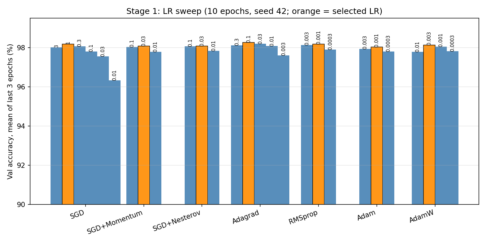

탐색 결과는 두 가지를 보여준다. 첫째, **적응형 계열(RMSprop/Adam/AdamW)은 작은
LR(0.001~0.003)** 에서 가장 좋았다. 둘째, 순수 SGD는 **LR 1.0이라는 매우 큰 값**이
최적이었는데, 이는 본 모델이 BatchNorm을 사용하기 때문이다. BatchNorm은 각 층 출력의
스케일을 정규화하므로 큰 LR에서도 학습이 안정적이며, 오히려 큰 LR이 빠른 진행과 규제
효과를 동시에 제공한다. 한편 LR 선택 자체는 단일 seed·10 epochs 결과이므로 0.05%p
수준의 근소한 차이는 노이즈일 수 있다는 한계가 있다(7장 한계 참조). 이후 모든 비교는
각 optimizer의 선택된 LR로 수행한다.

### 4.3 Stage 2 — 본 비교 결과 (20 epochs × 3 seeds)

#### 4.3.1 정확도 비교

| Optimizer | LR | Final Train Loss | Final Val Loss | Final Val Acc (%) | **Test Acc (%)** |
|---|---|---|---|---|---|
| **SGD** | **1.0** | 0.0193 | 0.0679 | **98.30 ± 0.10** | **98.40 ± 0.04** |
| SGD+Momentum | 0.03 | 0.0196 | 0.0650 | 98.19 ± 0.10 | 98.36 ± 0.10 |
| SGD+Nesterov | 0.03 | 0.0196 | 0.0651 | 98.21 ± 0.10 | 98.36 ± 0.02 |
| Adagrad | 0.1 | 0.0124 | 0.0640 | 98.27 ± 0.08 | 98.41 ± 0.03 |
| RMSprop | 0.001 | 0.0181 | 0.0693 | 98.27 ± 0.11 | 98.27 ± 0.05 |
| Adam | 0.001 | 0.0189 | 0.0666 | 98.22 ± 0.14 | 98.31 ± 0.10 |
| AdamW | 0.003 | 0.0228 | 0.0689 | 98.16 ± 0.07 | 98.26 ± 0.05 |

(±는 3개 seed의 표준편차. 굵은 글씨가 사전 선정 기준인 검증 정확도의 1위)

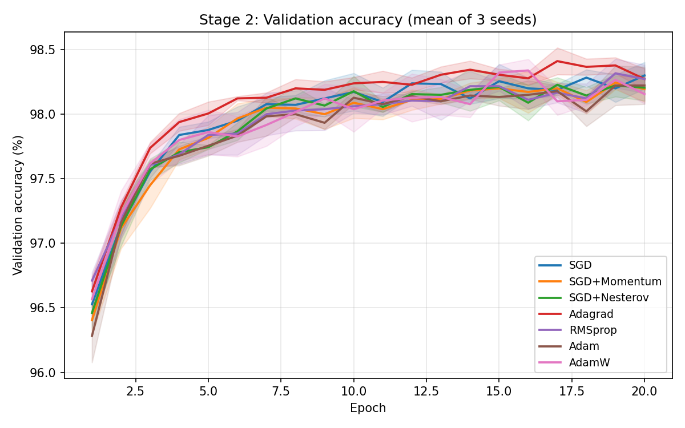
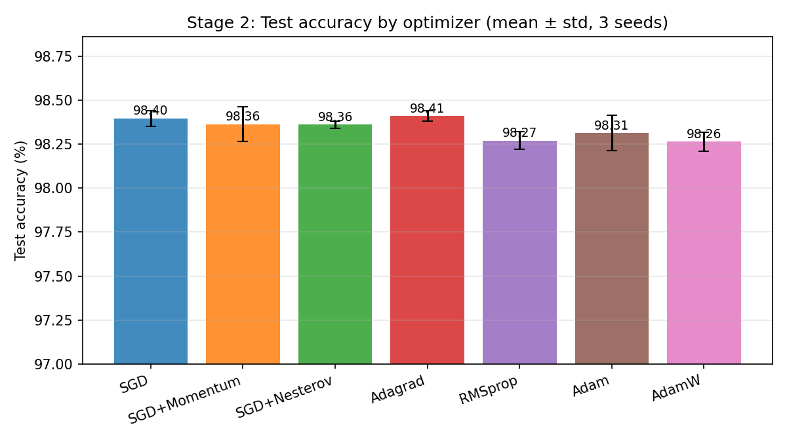

#### 4.3.2 Loss 수렴 속도 비교

| Optimizer | Val Acc 97% 도달 (epoch) | Val Acc 98% 도달 | Train Loss ≤ 0.1 | Train Loss ≤ 0.05 |
|---|---|---|---|---|
| SGD | 2.0 | 6.7 | 3.0 | 7.0 |
| SGD+Momentum | 2.3 | 7.7 | 3.0 | 7.7 |
| SGD+Nesterov | 2.3 | 7.3 | 3.0 | 7.7 |
| **Adagrad** | **2.0** | **5.0** | **3.0** | **6.0** |
| RMSprop | 2.0 | 6.3 | 3.0 | 7.0 |
| Adam | 2.0 | 7.7 | 3.0 | 7.0 |
| AdamW | 2.0 | 6.0 | 3.0 | 7.0 |

(3개 seed 평균. 작을수록 빠른 수렴)

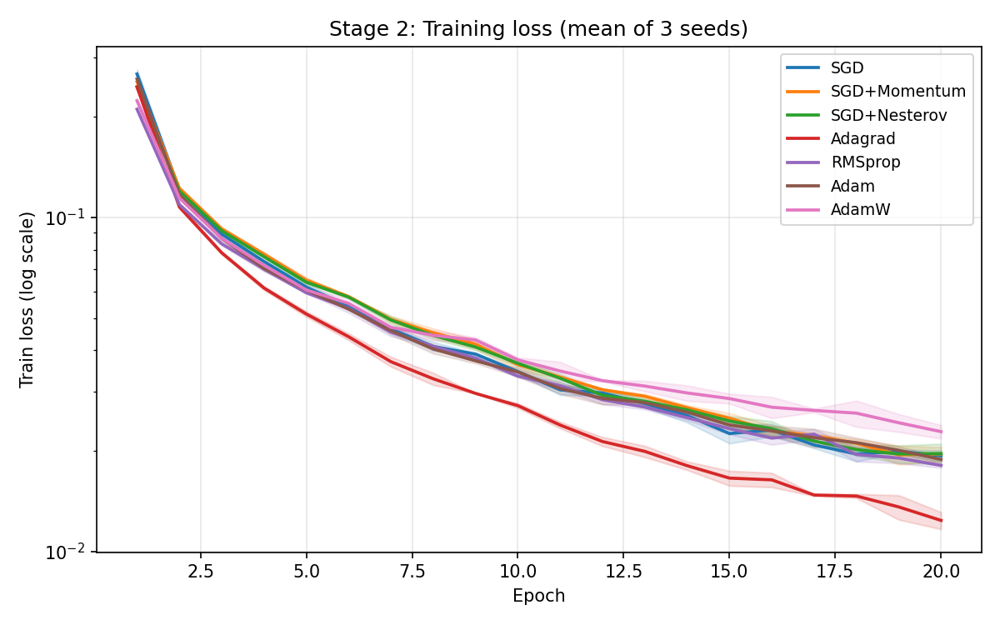
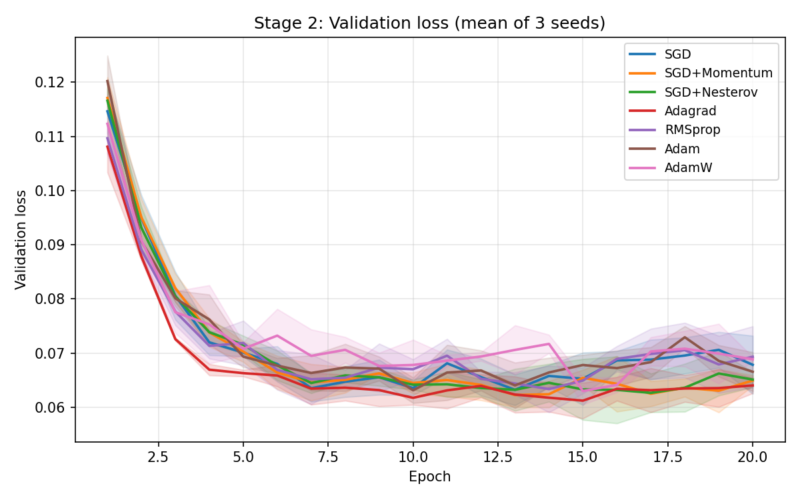

#### 4.3.3 분석

- **충분히 튜닝된 순수 SGD(LR 1.0)가 평균 1위**였다. 이는 "적응형 optimizer가 항상
  우월하다"는 통념과 다른 결과로, 핵심은 LR 튜닝이다. LR 탐색(4.2절)에서 SGD는
  LR 0.1일 때 97.81%로 7종 중 최하위권이었지만 LR 1.0에서는 98.18%로 전체 1~2위권으로
  올라섰다. 즉 **이 과제 설정에서는 optimizer 종류의 차이보다 LR 선택의 차이가 더
  컸다.** BatchNorm이 큰 LR을 허용해 주는 것이 전제 조건이다.
- 단, **상위 3개(SGD 98.30, Adagrad 98.27, RMSprop 98.27)의 평균 차이는 0.03%p로 seed
  표준편차(±0.08~0.11)보다 훨씬 작다.** seed별 1위도 서로 달랐다(seed 42: SGD 98.43,
  seed 123: Adam 98.38, seed 2025: Adagrad 98.28). 따라서 최종 정확도만으로는 상위권
  optimizer 간 우열을 단정할 수 없으며, SGD의 1위는 사전에 정한 선정 기준(3-seed 평균)에
  따른 선택이다. 테스트 정확도에서도 SGD(98.40)와 Adagrad(98.41)는 사실상 동률이었다.
- 반면 **수렴 속도는 Adagrad의 우위가 일관**되었다. 검증 정확도 98% 도달까지 평균
  5.0 epochs(seed별 6/4/5)로 모든 optimizer 중 가장 빨랐고, 학습 loss 0.05 도달도
  6.0 epochs로 1위였다. 파라미터별 누적 기울기 제곱으로 LR을 나누는 방식이 초반에는
  공격적인 학습을, 이후에는 LR 자연 감소로 안정적인 미세 조정을 제공하기 때문이다.
- **Momentum/Nesterov(LR 0.03)는 순수 SGD(LR 1.0)보다 낮았다.** momentum 0.9는 유효
  step 크기를 약 1/(1−0.9)=10배 증폭하므로 "작은 LR + momentum"은 "큰 LR의 순수 SGD"와
  유사한 동작이 된다. 즉 momentum의 이점이 큰 LR로 이미 흡수된 셈이며, momentum 추가가
  의미 있게 기여하려면 LR을 함께 더 정밀하게 탐색해야 했을 것이다. Nesterov는 look-ahead
  효과로 Momentum보다 근소하게 빨랐다.
- **RMSprop/Adam/AdamW는 안정적으로 수렴했으나 최종 정확도 상위권에는 못 미쳤다.**
  AdamW는 weight decay(0.01) 덕에 초반 수렴은 빨랐지만(98% 도달 6.0 epochs) 작은
  모델·짧은 학습에서는 규제가 다소 과해 최종 정확도가 가장 낮았다.

### 4.4 과제 (1) 결론

> **최종적으로 SGD (LR 1.0)가 가장 좋았다** — 사전에 정한 기준(3-seed 평균 최종 검증
> 정확도)에서 1위(98.30%, 테스트 98.40%)였다. 다만 Adagrad·RMSprop과의 차이는 seed
> 편차 이내이므로 "충분히 LR을 튜닝하면 단순한 SGD도 적응형 optimizer와 대등하거나
> 그 이상"이라는 것이 더 정확한 해석이며, **수렴 속도까지 고려하면 Adagrad(LR 0.1)가
> 가장 빠르게 같은 수준에 도달**했다. 본 과제는 선정 기준에 따라 **SGD(LR 1.0)를 과제
> (2)의 기준 optimizer로 사용**한다.

---

## 5. 과제 (2) — Learning Rate Scheduler 비교 평가

### 5.1 비교 대상 Scheduler (6종)

과제 (1)에서 선정된 optimizer에 다음 6종의 scheduler를 적용하여 동일 조건
(최적 LR, 20 epochs, 3 seeds)에서 비교하였다.

| Scheduler | 동작 방식 | 본 실험 설정 (기준 LR=1.0) |
|---|---|---|
| **None (상수 LR)** | scheduler 미적용 기준선 | — |
| **StepLR** | 일정 주기마다 LR을 계단식 감소 | 5 epochs마다 ×0.5 |
| **ExponentialLR** | 매 epoch LR을 지수적으로 감소 | gamma=0.9 |
| **CosineAnnealingLR** | LR을 코사인 곡선으로 서서히 감소 | T_max=20, eta_min=LR×0.01 |
| **ReduceLROnPlateau** | 검증 loss 개선이 멈추면 LR 감소 | factor=0.5, patience=2 |
| **OneCycleLR** | LR을 한 번 크게 올렸다가 낮추는 1-cycle 정책 (배치 단위 갱신) | max_lr=LR×3=3.0, pct_start=0.3 |

### 5.2 비교 결과

각 scheduler가 만드는 실제 LR 궤적은 아래와 같다 (epoch 시작 시점 기준, 로그 스케일).
ReduceLROnPlateau는 검증 loss 정체를 감지해 11, 16, 19번째 epoch에서 LR을 절반으로
줄였고(seed 42 기준), OneCycleLR은 LR을 3.0까지 올렸다가 0 근처까지 낮추는 한 사이클을
그린다.

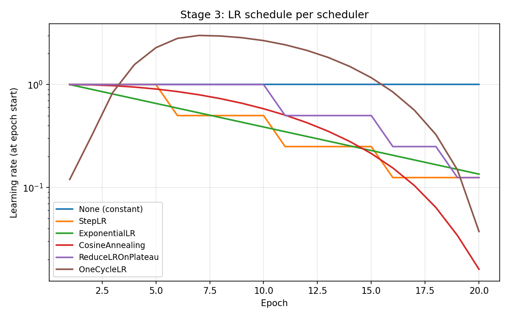

#### 정확도 및 수렴 속도

| Scheduler | Final Train Loss | Final Val Loss | Final Val Acc (%) | **Test Acc (%)** | Val 98% 도달 (epoch) |
|---|---|---|---|---|---|
| None (상수 LR) | 0.0193 | 0.0679 | 98.30 ± 0.10 | 98.40 ± 0.04 | 6.7 |
| StepLR | 0.0125 | 0.0549 | 98.48 ± 0.08 | 98.57 ± 0.05 | 6.0 |
| ExponentialLR | 0.0124 | 0.0549 | 98.46 ± 0.04 | 98.53 ± 0.06 | 5.3 |
| CosineAnnealing | 0.0105 | 0.0526 | 98.50 ± 0.06 | 98.54 ± 0.08 | 6.3 |
| ReduceLROnPlateau | 0.0095 | 0.0592 | 98.48 ± 0.02 | 98.55 ± 0.04 | 6.7 |
| **OneCycleLR** | **0.0090** | **0.0577** | **98.57 ± 0.08** | **98.58 ± 0.04** | 10.0 |

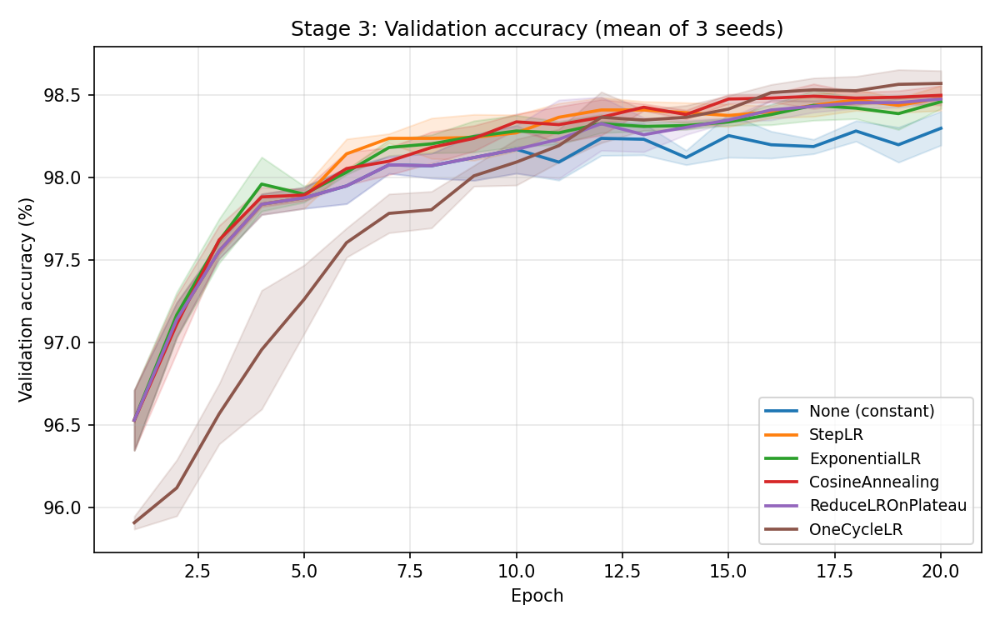
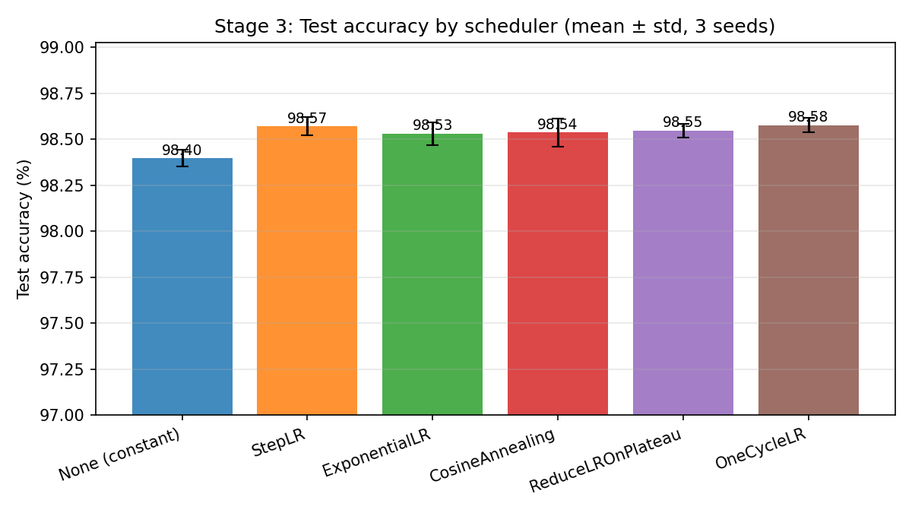
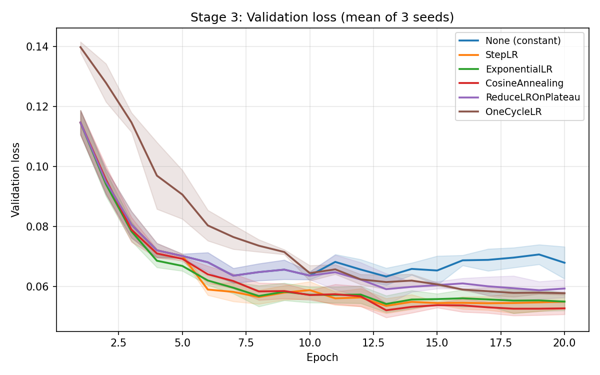

#### 분석

- **LR을 감쇠시키는 scheduler는 모두 상수 LR보다 최종 검증 정확도가 높았다**
  (98.30% → 98.46~98.57%). 최종 검증 loss도 일관되게 낮아졌고(0.0679 → 0.053~0.059),
  테스트 정확도도 전부 +0.13%p 이상 개선되었다. 후반부에 LR을 줄여 loss 표면의 최소점
  주변 진동을 줄이는 scheduler의 교과서적 이점이 그대로 재현된 것으로, 특히 기준 LR이
  1.0으로 큰 본 설정에서는 감쇠의 효과가 과제 (1)의 optimizer 간 차이보다 컸다.
- **OneCycleLR이 최종 검증 정확도 1위(98.57%)** 였고, 이번에는 테스트 정확도(98.58%)에서도
  가장 높아 검증 기준 선택과 테스트 결과가 일치했다. 초반 warmup 때문에 수렴은 가장
  느렸지만(98% 도달 10.0 epochs), LR을 3.0까지 올려 넓게 탐색한 뒤 0 근처까지 급감시키는
  정책(Smith & Topin, 2018)이 가장 낮은 최종 학습 loss(0.0090)와 가장 높은 일반화 성능을
  만들었다.
  즉 **OneCycleLR은 "초반 수렴 속도를 내주고 최종 품질을 얻는" 트레이드오프**를 보였다.
- 나머지 감쇠 계열(Step/Exponential/Cosine/Plateau)은 98.46~98.50%로 서로 seed 편차
  이내의 차이였다. 이들은 수렴 속도 손해 없이(98% 도달 5.3~6.7 epochs, 상수 LR과 동급)
  최종 정확도를 올렸으므로, 학습 예산이 매우 짧다면 OneCycle 대신 이 계열이 유리할 수
  있다.
- ReduceLROnPlateau는 "필요할 때만 감쇠"하는 적응적 동작(11/16/19 epoch에서 감쇠)으로
  최종 검증 정확도의 seed 편차가 ±0.02로 가장 안정적이었다.

### 5.3 과제 (2) 결론

> **최종적으로 OneCycleLR (max_lr 3.0, pct_start 0.3)이 가장 좋았다.** SGD 단독(상수
> LR 1.0) 대비 최종 검증 정확도를 98.30% → 98.57%로, 테스트 정확도를 98.40% → 98.58%로
> 끌어올렸으며, 검증 기준 1위와 테스트 기준 1위가 일치했다. 한편 어떤 종류든 LR 감쇠를
> 적용하는 것만으로 상수 LR보다 일관되게 좋아졌다는 점이 본 실험의 가장 견고한 관찰이다.
> 과제 (3) 앙상블은 SGD(LR 1.0) + OneCycleLR 조합으로 진행한다.

---

## 6. 과제 (3) — 앙상블 기법 적용

### 6.1 방법: 5-Fold 앙상블 + Voting

과제 (1), (2)에서 선정된 **최적 optimizer + 최적 scheduler** 조합으로 다음과 같이
앙상블을 구성하였다 (강의자료 `train_optimizer_scheduler_ensemble.py`의 K-Fold 방식 기반).

1. 전체 학습 데이터 60,000장을 **K=5 Fold**로 분할 (`KFold(shuffle=True, random_state=42)`)
2. 각 fold마다 "나머지 4개 fold(48,000장)로 학습, 해당 fold(12,000장)로 검증"하여
   **서로 다른 데이터·서로 다른 초기화(seed 42+fold)** 의 모델 5개를 학습
3. 테스트 시 5개 모델의 예측을 두 가지 방식으로 결합:
   - **Hard Voting (다수결)**: 각 모델의 예측 클래스 중 최다 득표 클래스 선택
     (동률 시 평균 확률이 높은 클래스)
   - **Soft Voting (확률 평균)**: 5개 모델의 softmax 확률을 평균한 뒤 argmax

학습/평가/추론 코드는 각각 `train_ensemble.py`, `test_ensemble.py`, `inference.py`로
제출물에 포함되어 있다. 본 실험 설정은 SGD(LR 1.0) + OneCycleLR, batch 128,
fold당 20 epochs이다. 또한 앙상블 결과가 1회 실행의 우연이 아닌지 확인하기 위해
**기본 seed를 바꾼 독립 반복 2회(seed 142, 2042)** 를 추가로 수행했고, 두 voting 방식의
표기 순서와 무관하게 **확률 평균 방식(Soft Voting)을 대표값으로 사전 지정**하였다.

### 6.2 결과

기본 실행(seed 42)의 결과는 다음과 같다.

| 구분 | Test Acc (%) | 오답 수 (/10,000) |
|---|---|---|
| Fold 0 단일 모델 | 98.59 | 141 |
| Fold 1 단일 모델 | 98.45 | 155 |
| Fold 2 단일 모델 | 98.63 | 137 |
| Fold 3 단일 모델 | 98.62 | 138 |
| Fold 4 단일 모델 | 98.56 | 144 |
| 단일 모델 평균 | 98.57 | 143 |
| 단일 모델 최고 (Fold 2) | 98.63 | 137 |
| 앙상블 (Hard Voting) | 98.72 | 128 |
| **앙상블 (Soft Voting)** | **98.74** | **126** |

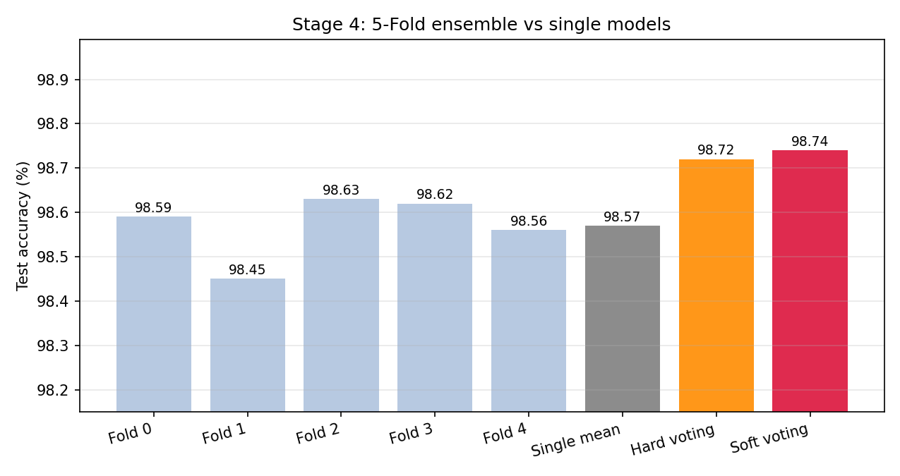

독립 반복 결과(앙상블 전체를 다른 기본 seed로 재학습):

| 실행 | 단일 평균 | 단일 최고 | Hard Voting | Soft Voting | 앙상블 이득 (vs 평균) |
|---|---|---|---|---|---|
| seed 42 (기본) | 98.57 | 98.63 | 98.72 | 98.74 | +0.15~0.17%p |
| seed 142 | 98.61 | 98.67 | 98.78 | 98.74 | +0.13~0.17%p |
| seed 2042 | 98.61 | 98.65 | 98.77 | 98.73 | +0.12~0.16%p |

Soft Voting 앙상블의 confusion matrix와, 테스트 샘플 1장에 대한 추론(inference) 데모는
아래와 같다. 5개 fold 모델이 모두 확신을 갖고 같은 답(6)을 내는 것을 볼 수 있다.

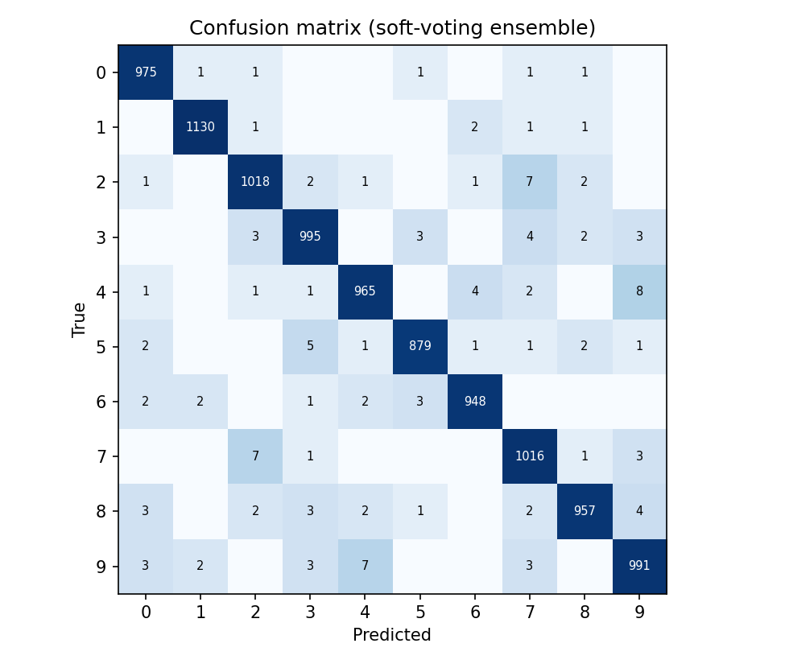
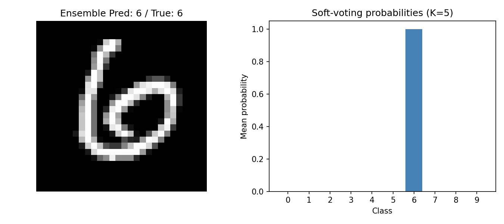

### 6.3 분석

- **앙상블(Soft Voting, 98.74%)은 단일 모델 평균(98.57%) 대비 +0.17%p, 가장 좋은 단일
  fold 모델(98.63%) 대비로도 +0.11%p 높았다.** 오답 수로는 평균 143개 → 126개로
  **약 12%의 오류 감소**다. 이 이득은 **3회 독립 반복 모두에서 재현**되었다
  (앙상블이 단일 평균을 +0.12~0.17%p, 단일 최고를 +0.07~0.12%p 일관되게 상회).
- 통계적 평가: 기본 실행에서 앙상블과 최고 단일 fold의 paired 비교(exact McNemar
  검정)는 "앙상블만 맞힌 샘플 32개 vs fold만 맞힌 샘플 21개, p=0.169"로, **1회 실행만으로는
  최고 단일 모델 대비 우위가 유의수준 5%에서 유의하지 않다.** 다만 세 번의 독립 반복
  모두에서 같은 방향의 이득이 나타났으므로(매 실행 앙상블만 맞힌 샘플이 더 많음),
  "앙상블이 단일 모델보다 안정적으로 좋다"는 결론은 실용적으로 타당하다.
- 향상의 원인은 **모델 다양성**이다. 각 fold 모델은 서로 다른 48,000장으로 학습되고
  초기화 seed도 다르므로 서로 다른 샘플에서 실수한다. 투표가 이러한 비상관 오류를
  상쇄해 개별 모델보다 안정적인 예측을 만든다.
- **공정한 해석을 위한 주의**: 과제 (2)의 단일 모델은 54,000장으로 학습된 1개 모델인
  반면, 5-Fold 앙상블은 합쳐서 60,000장 전체를 활용하며 학습·추론 비용도 5배다.
  따라서 7장의 누적 비교표에서 앙상블의 이득에는 순수한 앙상블 효과 외에 데이터·비용
  증가분도 일부 포함되어 있다. (본 과제 환경에서는 앙상블 1회 학습이 GPU로 약 2분이라
  비용 부담 자체는 크지 않다.)
- Hard Voting(98.72%)과 Soft Voting(98.74%)은 사실상 동률이었다(반복 실행에서는 hard가
  근소 우위인 경우도 있음). 모델들이 대체로 높은 확신을 가질 만큼 충분히 학습되어,
  확률 평균과 다수결이 거의 같은 결정을 내리기 때문이다.
- confusion matrix를 보면 남은 126개 오류는 사람도 혼동하기 쉬운 **4↔9 (15개),
  2↔7 (14개), 3↔5 (8개)** 쌍에 집중되어 있다. 이런 오류는 optimizer/scheduler/앙상블
  같은 최적화 기법만으로는 줄이기 어렵고, 공간 구조를 활용하는 CNN 등 모델 구조
  개선이 필요한 영역이다.

---

## 7. 종합 결론

세 단계의 개선을 거치며 테스트 정확도는 다음과 같이 누적 향상되었다.

| 단계 | 구성 | Test Acc (%) | 오답 수 |
|---|---|---|---|
| 과제 (1) | **SGD (LR 1.0)**, 상수 LR — 7종 중 선정 | 98.40 | 160 |
| 과제 (2) | SGD + **OneCycleLR** | 98.58 | 142 |
| 과제 (3) | + **5-Fold 앙상블 (Soft Voting)** | **98.74** | **126** |

(참고: 최하위 optimizer였던 AdamW 기준선 98.26% 대비로는 +0.48%p, 오답 174→126개)

1. **Optimizer**: 7종 비교 결과, 사전 기준(3-seed 평균 최종 검증 정확도)으로는
   **SGD(LR 1.0)** 가 1위였다. 단 Adagrad·RMSprop과의 차이는 seed 편차 이내였으므로,
   본 실험의 더 중요한 교훈은 "**optimizer 종류보다 learning rate 튜닝이 더 결정적**이며,
   충분히 튜닝된 순수 SGD는 적응형 optimizer와 대등하다"는 것이다. **loss 수렴 속도
   기준으로는 Adagrad(LR 0.1)** 가 가장 빨랐다(검증 98% 도달 5.0 vs SGD 6.7 epochs).
2. **Scheduler**: 후반부 LR 감쇠는 종류와 무관하게 상수 LR보다 일관되게 좋았고
   (+0.16~0.27%p), 그중 **OneCycleLR** 이 검증·테스트 모두 1위였다. OneCycle은 초반
   수렴이 느린 대신 최종 일반화가 가장 좋은 트레이드오프를 보였다.
3. **앙상블**: 데이터 분할과 초기화가 다른 5개 모델의 Soft Voting으로 단일 모델 평균
   대비 오류를 약 12% 줄였고(98.57% → 98.74%), 이 이득은 독립 반복 3회에서 모두
   재현되었다. 모델 구조 변경 없이 최적화 기법과 앙상블만으로 **테스트 정확도 98.74%,
   과제 (1) 시점의 최적 단일 모델 대비 오답 160개 → 126개(약 21% 감소)** 가 본 과제의
   최종 결과다.

**한계 및 추후 과제**:
- 상위권 optimizer 간 차이(0.03%p)는 seed 편차보다 작아, 1위 선정은 사전 기준에 따른
  것일 뿐 통계적 우열은 아니다. LR 탐색 또한 단일 seed·10 epochs로 수행되어 선택
  자체에 노이즈가 있다(이를 완화하기 위해 최적 LR이 그리드 내부에 올 때까지 그리드를
  확장했고, 실제로 확장 전후 optimizer 순위가 달라졌다 — LR 탐색 범위가 결론을 좌우할
  수 있음을 보여주는 사례다).
- 본 결론은 "BatchNorm을 쓰는 고정 MLP, batch 128, 20 epochs" 조건의 결과다. BatchNorm이
  없거나 더 깊은 모델, 더 긴 학습에서는 큰 LR의 SGD가 불안정해지고 적응형 optimizer가
  유리해지는 등 순위가 달라질 수 있다.
- 7장 누적표에서 앙상블 행의 이득에는 학습 데이터 증가(54k→60k 합산)와 5배 비용이
  포함되어 있다(6.3절 참조).
- 남은 오류가 4↔9, 2↔7 같은 형태 혼동에 집중된 만큼, CNN 구조 도입과 data
  augmentation이 자연스러운 다음 단계다.

---

## 8. 재현 방법 (제출 코드 안내)

제출 압축파일의 구성과 실행 방법은 다음과 같다. (자세한 내용은 동봉된 `README.md` 참조)

```
code/
├── data_loader.py        # MNIST 로드/표준화, train/val 분할
├── model.py              # MLP 784-256-256-10 (BN, Dropout 0.2)
├── engine.py             # 학습 루프, optimizer/scheduler 팩토리, seed 고정
├── train.py              # 단일 설정 학습(과제 1, 2의 실험 단위) + 테스트 평가
├── test.py               # 저장된 단일 모델 테스트 평가
├── train_ensemble.py     # 5-Fold 앙상블 학습 (과제 3 - train)
├── test_ensemble.py      # 앙상블 평가, Hard/Soft Voting (과제 3 - test)
├── inference.py          # 단일 샘플 앙상블 추론 + 시각화 (과제 3 - inference)
├── run_experiments.py    # 과제 (1)(2)(3) 전체 실험 자동 실행
├── plot_results.py       # 본 보고서의 그림/표 생성
├── requirements.txt
└── README.md
```

```bash
# 전체 실험 재현 (Stage 1~4 자동 실행, GPU 기준 약 20~30분)
python run_experiments.py
python plot_results.py        # 그림/표 생성

# 과제 (3)만 개별 실행 (train → test → inference)
python train_ensemble.py --optimizer sgd --scheduler onecycle --lr 1.0 --k_splits 5 --epochs 20
python test_ensemble.py  --model_prefix ../results/models/ensemble/mlp_mnist --k_splits 5
python inference.py      --model_prefix ../results/models/ensemble/mlp_mnist --k_splits 5 --sample_idx 11

# (선택) 앙상블 독립 반복 — 6.2절의 반복 검증 재현
python train_ensemble.py --optimizer sgd --scheduler onecycle --lr 1.0 --k_splits 5 --epochs 20 \
    --seed 142 --save_prefix ../results/models/ensemble_rep142/mlp_mnist --log_dir ../results/logs/ensemble_rep142
python test_ensemble.py  --model_prefix ../results/models/ensemble_rep142/mlp_mnist --k_splits 5 \
    --log_path ../results/logs/ensemble_rep142/ensemble_test.json
```

모든 실험 로그(JSON), 단계별 선택 결과(`decisions.json`), 그림, 학습된 모델 가중치는
`results/` 폴더에 저장된다.

---

## 부록 A. 동일 LR 고정 비교 — per-optimizer LR 탐색이 필요한 이유

3.5절 1번 원칙의 근거 자료로, 모든 optimizer를 강의 코드(`train_optimizer.py`)의 기본값인
**LR 0.01로 고정**했을 때의 결과(10 epochs, seed 42, 마지막 3 epoch 평균 검증 정확도)를
자체 최적 LR에서의 결과와 비교한다.

| Optimizer | LR 0.01 고정 | (순위) | 자체 최적 LR | 최적 LR 적용 | (순위) |
|---|---|---|---|---|---|
| SGD | 96.32% | 7위 | 1.0 | 98.18% | **2위** |
| SGD+Momentum | 97.78% | 6위 | 0.03 | 98.08% | 5위 |
| SGD+Nesterov | 97.83% | 4위 | 0.03 | 98.07% | 6위 |
| Adagrad | 98.07% | 2위 | 0.1 | 98.26% | **1위** |
| RMSprop | 98.08% | 1위 | 0.001 | 98.18% | 2위 |
| Adam | 97.94% | 3위 | 0.001 | 98.03% | 7위 |
| AdamW | 97.79% | 5위 | 0.003 | 98.13% | 4위 |

LR을 0.01로 고정하면 **SGD는 7위(96.32%)로 1.86%p나 과소평가**되고, 순위표 전체가
"0.01이라는 LR이 누구에게 유리한가"에 의해 재배열된다(예: SGD 7위→2위, Adam 3위→7위).
즉 동일 LR 비교는 optimizer의 잠재력이 아니라 LR과의 궁합을 측정한다. 이것이 본 보고서가
optimizer별 최적 LR을 먼저 탐색한 뒤 비교한 이유다. (위 표는 10 epochs 탐색 단계 기준으로,
본문 4.3절의 20 epochs × 3 seeds 본 비교와는 epoch 수가 다르다.)

---

## 부록 B. 실험 과정에서 검토한 기술적·학술적 관행 노트

실험을 설계·검증하는 과정에서 마주친 쟁점들과, 각각에 대한 일반적인 관행을 정리한다.
모든 항목은 본 실험에서 실제로 검토했거나 겪은 사례에 근거한다.

**B.1 전처리 통계와 데이터 누수(data leakage)의 경계.**
본 코드는 정규화 평균/표준편차를 학습 데이터 60,000장 전체에서 계산한 뒤 train/val을
분할한다. "분할 전에 통계를 계산하면 검증 데이터의 픽셀이 통계에 섞이니 누수가 아닌가?"
라는 질문이 가능하다. 가장 엄격한 원칙은 "분할 후 train 부분만으로 통계를 추정"하는
것이지만, 본 사례는 관행적으로 허용되는 범위다. ① 검증 데이터도 학습용 60k의 일부이며
모델 가중치 학습에 쓰이지 않을 뿐이고, ② 입력 평균/표준편차는 라벨과 무관한 비지도
통계이며, ③ 54k와 60k의 픽셀 통계는 사실상 동일해 결과에 영향이 없다. **절대 넘으면
안 되는 선은 test set이다** — test 데이터는 통계 추정에도, 모델·하이퍼파라미터 선택에도
쓰여서는 안 되며, 본 코드도 test는 "train에서 추정한 통계로" 정규화만 한다. 누수 판단의
기준은 "test에 대한 정보가 학습·선택 과정으로 흘러 들어갔는가"이다.

**B.2 하이퍼파라미터 탐색 프로토콜이 비교 결과를 좌우한다.**
본 실험에서 LR 그리드를 확장하자 optimizer 1위가 Adagrad에서 SGD로 바뀌었다(3.5절).
이는 우연한 해프닝이 아니라 학계에서 반복적으로 확인된 현상으로, "optimizer 간 비교
결과는 각 optimizer에 허용된 튜닝 프로토콜(탐색 범위·예산)에 의해 뒤집힐 수 있다"는
것이 대규모 재현 연구들의 핵심 결론이다 (Choi et al., 2019; Schmidt et al., 2021).
따라서 비교 실험 보고서는 결과 수치만이 아니라 **탐색 범위와 선정 기준 자체를 함께
공개**해야 독자가 결론의 적용 한계를 판단할 수 있다 — 본 보고서가 4.2절에 탐색 그리드
전체를 표로 싣는 이유다.

**B.3 같은 test set 위의 두 분류기 비교에는 paired 검정을 쓴다.**
"98.74% vs 98.63%"처럼 차이가 test 샘플 몇십 개 수준일 때, 그 차이가 우연인지 판단하려면
통계 검정이 필요하다. 이때 두 분류기는 **같은 10,000장에서 평가되므로 독립 표본 가정이
깨지며**, 관행은 두 모델의 정답/오답이 엇갈린 샘플만 보는 McNemar 검정이다 (Dietterich,
1998). 본 실험은 이를 `test_ensemble.py`에 구현해 앙상블 vs 최고 단일 fold의 차이가 1회
실행으로는 유의하지 않음(p=0.169)을 확인했고, 그래서 독립 반복 3회로 이득의 방향이
일관됨을 보이는 방식으로 주장을 보강했다. "유의하지 않은 차이를 유의한 것처럼 쓰지
않는 것"도 보고의 일부다.

**B.4 변인 통제: 분할 seed와 모델 seed의 분리.**
본 실험은 train/val 분할 seed는 42로 전 실험 고정하고, 모델 초기화·미니배치 셔플
seed만 3가지로 바꿨다. 둘을 함께 바꾸면 측정된 분산에 "데이터 분할 차이"와 "초기화
차이"가 섞여 해석이 어려워진다. 비교 실험에서는 **비교 대상 외의 모든 무작위 요인을
고정하거나, 바꾸는 요인을 명시적으로 한 가지로 제한**하는 것이 원칙이다.

**B.5 최종 epoch 보고 vs 최고 검증 시점(checkpoint) 보고.**
실무 표준은 매 epoch 검증 성능을 보고 최고 시점의 가중치를 저장(checkpointing)해
사용하는 것이다. 본 실험은 "마지막 epoch 성능 보고"로 단순화했는데, 로그로 확인한 결과
LR 감쇠 scheduler가 있으면 둘의 차이가 평균 +0.04%p로 미미했고(종반 LR이 작아 성능이
안정), 가장 큰 차이(+0.18%p)는 상수 LR에서 났다. 즉 **LR 감쇠는 "언제 멈춰도 비슷한"
안정된 종반을 만들어 주는 효과**도 있으며, 상수 LR로 학습한다면 checkpoint 저장이 더
중요해진다.

**B.6 모든 수치는 로그에서 자동 생성한다.**
본 보고서의 모든 표·그림은 각 실행이 남긴 JSON 로그(설정 + epoch별 지표)로부터
`plot_results.py`가 자동 생성했고, 보고서의 수치는 전부 로그 파일로 역추적할 수 있다.
수기로 옮겨 적는 순간 전사 오류가 생기고 재현성이 끊긴다. 단계별 선택의 근거
(`decisions.json`)까지 기계가 읽을 수 있는 형태로 남기는 것이 최근 학회들의 재현성
체크리스트가 요구하는 방향이다.

**B.7 경과 시간 측정은 단조(monotonic) 시계로 한다.**
개발 중 첫 epoch 소요 시간이 음수(-36초)로 기록되는 일이 있었다. `time.time()`은 OS의
시계 동기화로 뒤로 점프할 수 있기 때문으로(WSL2에서 흔함), 경과 시간 측정은 뒤로 가지
않는 것이 보장되는 `time.monotonic()`을 쓰는 것이 정석이다. 벤치마크 수치의 신뢰성은
이런 기본기에서 시작된다.

---

## 참고문헌

- A. C. Wilson et al., "The Marginal Value of Adaptive Gradient Methods in Machine
  Learning", NeurIPS 2017.
- D. Choi et al., "On Empirical Comparisons of Optimizers for Deep Learning",
  arXiv:1910.05446, 2019.
- R. M. Schmidt, F. Schneider, P. Hennig, "Descending through a Crowded Valley —
  Benchmarking Deep Learning Optimizers", ICML 2021.
- T. G. Dietterich, "Approximate Statistical Tests for Comparing Supervised
  Classification Learning Algorithms", Neural Computation 10(7), 1998.
- L. N. Smith, N. Topin, "Super-Convergence: Very Fast Training of Neural Networks
  Using Large Learning Rates", arXiv:1708.07120, 2018. (OneCycle 정책)
- I. Loshchilov, F. Hutter, "Decoupled Weight Decay Regularization", ICLR 2019. (AdamW)
