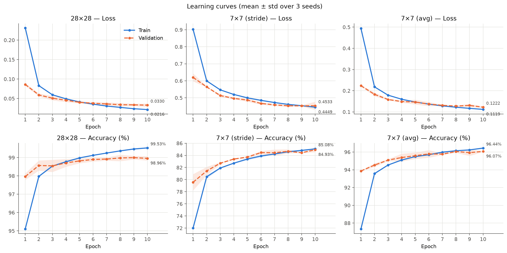
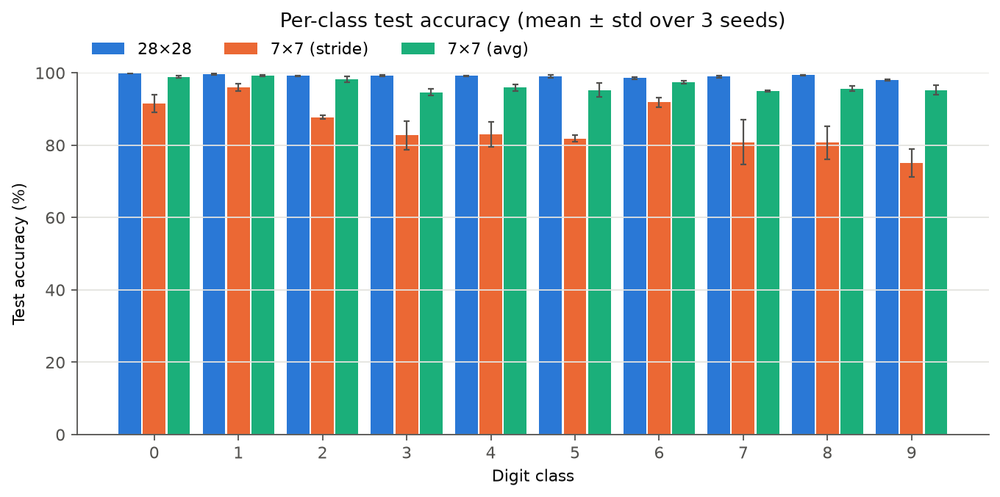
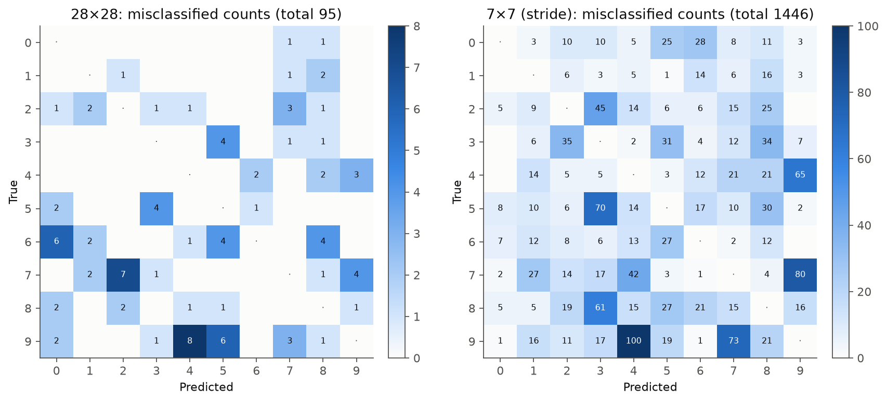
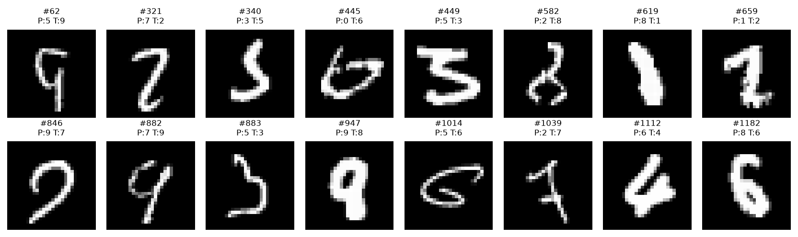
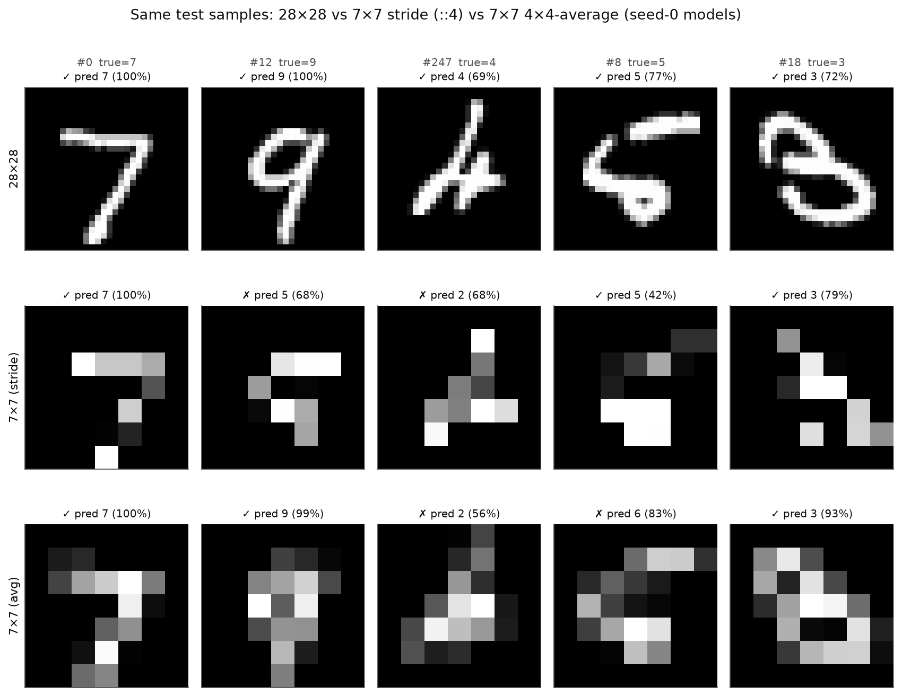
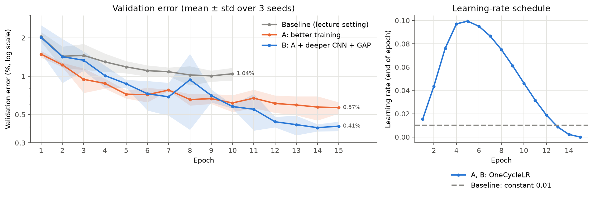
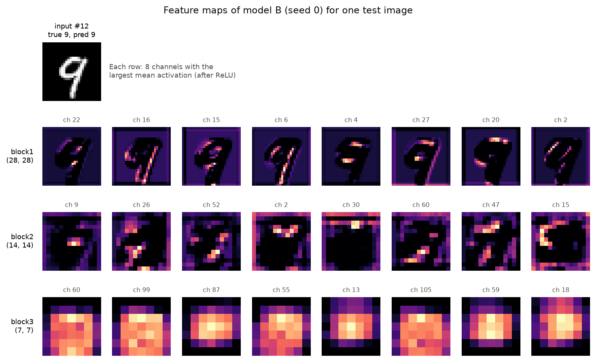
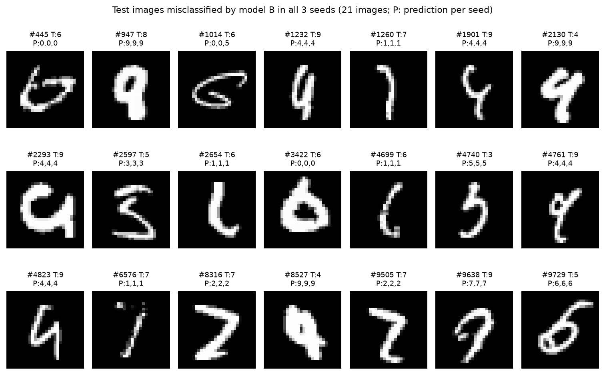

# 딥러닝기초 과제 3 보고서

## MNIST 원본 크기(28×28) 입력을 사용한 CNN 학습·성능평가·추론

- **학번**: 202258096
- **이름**: 임준현
- **제출물**: 본 보고서 1부, 코드 압축파일 1개 (`202258096_임준현_딥러닝기초_과제3코드.zip`)
- **제출일**: 2026년 9월 29일

## 목차

- [1. 개요](#1-개요)
   - [1.1 과제 목표](#11-과제-목표)
   - [1.2 결과 요약](#12-결과-요약)
- [2. 문제 정의](#2-문제-정의)
- [3. 해결 과정](#3-해결-과정)
   - [3.1 전체 흐름](#31-전체-흐름)
   - [3.2 진행 중 부딪힌 문제와 대응](#32-진행-중-부딪힌-문제와-대응)
- [4. 코드 수정](#4-코드-수정)
   - [4.1 층별 텐서 크기 계산](#41-층별-텐서-크기-계산)
   - [4.2 수정 내역](#42-수정-내역)
   - [4.3 원본 코드에서 발견한 문제점](#43-원본-코드에서-발견한-문제점)
- [5. 모델 구조 및 복잡도](#5-모델-구조-및-복잡도)
- [6. 실험 환경 및 설정](#6-실험-환경-및-설정)
   - [6.1 실험 환경](#61-실험-환경)
   - [6.2 실험 설정](#62-실험-설정)
- [7. 학습 결과](#7-학습-결과)
- [8. 성능 평가 (test.py)](#8-성능-평가-testpy)
   - [8.1 테스트 정확도](#81-테스트-정확도)
   - [8.2 클래스별 정확도](#82-클래스별-정확도)
   - [8.3 혼동행렬](#83-혼동행렬)
   - [8.4 28×28 모델의 오분류 샘플](#84-2828-모델의-오분류-샘플)
- [9. 추론 결과 (inference.py)](#9-추론-결과-inferencepy)
- [10. 고찰](#10-고찰)
   - [10.1 7×7 입력의 성능 저하 원인: 해상도인가, 줄이는 방식인가](#101-77-입력의-성능-저하-원인-해상도인가-줄이는-방식인가)
   - [10.2 수용영역 관점](#102-수용영역-관점)
   - [10.3 실험의 한계](#103-실험의-한계)
- [11. 추가 실험: 증강·앙상블 없이 성능 높이기](#11-추가-실험-증강앙상블-없이-성능-높이기)
   - [11.1 실험 설계](#111-실험-설계)
   - [11.2 결과](#112-결과)
   - [11.3 B는 무엇을 보는가: 특징맵](#113-b는-무엇을-보는가-특징맵)
   - [11.4 그래도 남는 오류](#114-그래도-남는-오류)
- [12. 결론](#12-결론)
- [부록 A. 실행 방법](#부록-a-실행-방법)

---

<!-- 본문 시작: build_report.py는 이 줄 아래만 docx 본문으로 사용하고, 표지·목차는 따로 생성함 -->

## 1. 개요

### 1.1 과제 목표

> **과제 요구사항**: `pr_week_04_torch_mnist_cnn` 폴더의 `train.py`, `test.py`, `inference.py`,
> `model_v3.py` 파일들을 MNIST 데이터의 원본 크기(original size)를 사용해서 학습, 성능평가, 추론하고
> 그 결과에 대한 보고서를 제출한다.

강의자료 코드는 MNIST 이미지를 4픽셀 간격으로 골라낸 **7×7 입력**을 기준으로 작성되어 있다. 본 과제에서는
이 코드를 **원본 크기 28×28 입력**으로 동작하도록 고쳐 학습 → 성능평가 → 추론을 수행하고, 7×7 입력과 같은 조건에서
비교하여 입력 크기가 성능과 모델 복잡도에 미치는 영향을 분석하였다.

### 1.2 결과 요약

**표 1.** 주요 결과 (seed 3개 평균 ± 표본 표준편차)

| 입력 | 테스트 정확도 | 오분류 수 (10,000장 중) | 파라미터 수 | 연산량 (1장) |
|------------------------------|------------------|----------------|------------|------------|
| **28×28 (본 과제)** | **99.10 ± 0.04 %** | 90 | 825,162 | 4.80 M MACs |
| 7×7, 4칸마다 1픽셀 선택 (강의 코드 방식) | 85.27 ± 0.25 % | 1,473 | 38,730 | 0.21 M MACs |
| 7×7, 4×4 블록 평균 (비교용) | 96.58 ± 0.26 % | 342 | 38,730 | 0.21 M MACs |

- 28×28 입력 CNN의 테스트 정확도는 **99.10%**로, 강의 코드의 7×7 입력보다 **13.83%p** 높았다. 늘어난 파라미터는
  전부 첫 번째 FC층(`fc1`)에서, 늘어난 연산량은 대부분 합성곱층에서 생겼다(5장).
- 13.83%p 격차 중 약 11.3%p는 해상도가 아니라 **7×7로 줄이는 방식**(4칸마다 1픽셀 선택) 때문이었다(10.1절).
- 원본 코드에서 **오류 없이 잘못된 결과를 내는 코드** 등 4가지 문제를 찾아 수정하였다(4.3절).
- 추가 실험으로 학습 설정과 구조를 개선하여, 증강·앙상블 없이 **99.66%**(파라미터는 1/3)까지 올렸다(11장).

---

## 2. 문제 정의

원본 코드를 실행 흐름대로 읽으며 7×7 입력을 전제로 한 부분을 찾고, 해결할 문제를 다섯 가지로 정리하였다.

**표 2.** 해결해야 할 문제

| 번호 | 문제 (원본 코드) | 해결 방법 | 해당 절 |
|-------|--------------------------------------|----------------------------------------|----------|
| P1 | 모델이 7×7 입력에 고정됨 (`x.view(-1, 1, 7, 7)`, `nn.Linear(64 * 1 * 1, 256)`) | 층별 특징맵 크기를 계산해 `fc1` 입력 차원을 입력 크기로부터 구함 | 4.1 |
| P2 | 입력 크기 옵션을 끌 수 없음 (`--use_small`, `type=bool, default=True`) | 플래그(`store_true`)로 변경 | 4.3 |
| P3 | 평가·추론 스크립트가 다른 모델을 씀 (`test.py`, `inference.py`가 `MLP` 사용) | 세 스크립트가 같은 전처리와 `CNN(in_size)`를 공유 | 4.2 |
| P4 | 잘못되어도 오류가 나지 않는 코드가 있어 수정이 맞는지 확신할 수 없음 | 층별 출력 shape을 손계산과 대조, 잘못된 입력은 즉시 오류가 나도록 수정 | 3.2, 4.3 |
| P5 | 결과를 해석할 기준이 없음 (한 번 실행한 99%가 좋은지 판단 불가) | seed 3회 반복, 7×7 비교군, 원인을 분리하는 비교 실험 | 6.2, 10.1 |

**성공 기준**: ① 세 스크립트가 28×28 입력에서 같은 전처리·모델로 오류 없이 동작하고, ② 모든 층의 출력 shape이
손계산과 일치하며 크기가 맞지 않는 입력은 즉시 오류를 내고, ③ 성능을 seed 3개의 평균 ± 표준편차로 보고하며,
④ 7×7과의 성능 차이를 근거를 들어 설명한다.

---

## 3. 해결 과정

### 3.1 전체 흐름

**표 3.** 단계별 해결 과정

| 단계 | 한 일 | 확인 방법 | 결과 |
|----------|--------------------------------------|--------------------|----------------------------------|
| ① 분석 | 요구사항과 원본 코드에서 7×7 전제 부분 목록화 | 코드 읽기 | P1~P3 발견 |
| ② 설계·구현 | 층별 텐서 크기를 손으로 계산하고 5개 파일 수정 | 더미 입력을 모델에 통과 | 출력 (64, 10), 파라미터 825,162개로 손계산과 일치 |
| ③ 동작 확인 | 1 에폭만 학습하는 스모크 테스트 | 학습 로그 | 검증 정확도 98.17%로 정상 학습 |
| ④ 원본 문제 재현 | 원본 코드의 의심 부분을 직접 실행 | `original_bugs.txt` | P2, P4 확인 (4.3절) |
| ⑤ 실험 | 28×28 / 7×7 × seed 3개 학습·평가·추론 | `run_experiments.py` | 표 1 |
| ⑥ 검토·보완 | 결과와 코드를 다시 점검하고 원인 분리 실험 추가 | 재실행, 재평가 | 3.2절 문제 해결, 10.1절 |

### 3.2 진행 중 부딪힌 문제와 대응

**(1) 학습 시간이 음수로 기록됨.** 첫 실험에서 학습 시간이 `-45.1s`, `-45.8s`로 기록되었다. 시스템 시계를 읽는
`time.time()`은 WSL2처럼 실행 중 시계가 보정되면 뒤로 갈 수 있다. 항상 증가하는 `time.perf_counter()`로 바꾸고
모든 실험을 다시 실행하였다.

**(2) 같은 seed인데 정확도가 조금 달라짐.** 재실행 결과 테스트 정확도가 미세하게 달랐다(28×28 seed 0: 99.07% → 99.05%,
7×7 seed 0: 85.14% → 85.54%). GPU의 일부 연산은 합산 순서가 실행마다 달라 결과가 완전히 같지 않기 때문이다(6.2절).
그래서 한 번의 결과가 아니라 **seed 3개의 평균 ± 표준편차**로 보고하였다(보고서 수치는 모두 재실행 결과).

**(3) 수정한 모델에도 조용한 오류 가능성이 남아 있었음.** 처음에는 입력 reshape을 `x.view(-1, 1, in_size, in_size)`로
두었는데, 이 상태에서 `CNN(28)`에 49차원 입력 64개를 넣으면 오류 없이 (4, 10)이 출력되었다. 원본과 같은 유형의 문제(P4)였다.
배치 차원을 `x.size(0)`로 명시해 즉시 `RuntimeError`가 나도록 고쳤고, 올바른 입력에서는 계산이 같으므로 저장된 모델의
정확도가 그대로임(99.05%, 85.54%)을 확인하였다.

---

## 4. 코드 수정

### 4.1 층별 텐서 크기 계산

합성곱층은 `kernel_size=3, stride=1, padding=1`이라 크기를 유지하고, `MaxPool2d(2, 2)`는 크기를 절반으로 줄인다(나머지는 버림).
출력 크기 공식 $\lfloor (N + 2P - K)/S \rfloor + 1$ ($N$: 입력 크기, $P$: 패딩, $K$: 커널 크기, $S$: 보폭)로 구하면 다음과 같다.

**표 4.** 입력 크기별 층별 텐서 크기 (B: 배치 크기)

| 층 | 7×7 입력 (기존) | 28×28 입력 (본 과제) |
|----------------------------------|---------------------------------|---------------------------------|
| 입력 reshape | (B, 1, 7, 7) | (B, 1, 28, 28) |
| conv1 (1→32) → pool1 | (B, 32, 7, 7) → (B, 32, 3, 3) | (B, 32, 28, 28) → (B, 32, 14, 14) |
| conv2 (32→64) → pool2 | (B, 64, 3, 3) → (B, 64, 1, 1) | (B, 64, 14, 14) → (B, 64, 7, 7) |
| flatten → `fc1` 입력 | **64** | **64 × 7 × 7 = 3,136** |
| `fc1` → `fc2` | 256 → 10 | 256 → 10 |

따라서 `fc1`은 `nn.Linear(3136, 256)`이어야 한다. 상수로 적으면 입력 크기가 바뀔 때마다 고쳐야 하므로 `64 × (in_size // 4)²`로
계산하도록 구현하였다. 7×7 입력은 7 → 3 → 1로 줄며 나누어떨어지지 않는 마지막 행·열이 풀링에서 버려지지만, 28×28은
28 → 14 → 7로 버려지는 위치가 없다.

> **알아두기 | 손계산한 shape을 코드로 바로 확인하기**
>
> 층마다 forward hook을 달고 더미 텐서를 한 번 통과시키면 모든 층의 출력 shape을 한 번에 볼 수 있다.
>
> ```python
> for name, layer in model.named_children():
>     layer.register_forward_hook(lambda m, i, o, n=name: print(n, tuple(o.shape)))
> model.eval(); model(torch.zeros(2, 784))   # ... pool2 (2, 64, 7, 7) ... fc2 (2, 10)
> ```

### 4.2 수정 내역

**표 5.** 주요 수정 내역 (필수: 과제 수행에 필요, 버그: 원본 코드 결함 수정)

| 파일 | 구분 | 수정 내용 |
|--------------------------|--------|------------------------------------------------------------------|
| `model_v3.py` | 필수 | `CNN(in_size=28)`: 입력 크기를 인자로 받고 `fc1` 입력 차원을 `64 × (in_size // 4)²`로 계산 |
| `model_v3.py` | 버그 | reshape은 `x.view(x.size(0), 1, s, s)`, flatten은 `x.flatten(1)`로 배치 차원 명시 |
| `data_loader.py` | 필수 | 기본값을 원본 28×28로 변경 |
| `train.py`, `test.py`, `inference.py` | 버그 | `--use_small`을 플래그(`action="store_true"`, 기본값 28×28)로 변경 |
| `test.py`, `inference.py` | 필수 | `MLP` → `CNN(in_size)`, 기본 가중치 경로를 CNN 모델로 변경 |
| `test.py` | 버그 | 배치 크기가 1이면 `squeeze()`가 0차원 텐서를 만들어 실패하는 부분을 `view(-1)`로 수정 |

이 밖에 분석용으로 seed 고정, 학습 곡선 JSON 저장, 혼동행렬·오분류 샘플 저장, 7×7 다운샘플 방식 선택(`--small_method`),
실험 자동화 스크립트(`run_experiments.py`, `plot_results.py`, `extra_checks.py`, `extra_experiment.py`)를 추가하였다.
세 스크립트는 `load_mnist()`의 같은 전처리를 쓰고, 입력 차원(784 또는 49)에서 `in_size`를 계산해 같은 구조의 CNN을 만든다.

### 4.3 원본 코드에서 발견한 문제점

다음은 원본 코드를 직접 실행해 확인한 결과이다(번호는 `results/logs/original_bugs.txt`와 같고, 4번은 코드 검토로 확인).

**표 6.** 원본 코드의 문제점

| # | 증상 | 실행 결과 | 원인 | 수정 |
|----|----------------------|----------------------|------------------------------|----------------------|
| 1 | `--use_small False`로 실행해도 7×7 입력 사용 | `use_small = True` | `type=bool`은 문자열에 `bool()`을 적용하므로 `bool("False") = True` | 플래그(`store_true`)로 변경 |
| 2 | 참고 파일 `model_no_samll_input.py`의 출력 배치가 바뀜 | 배치 64 → **(32, 10)**, 배치 63 → `RuntimeError` | 채널이 32인데 `view(-1, 64*7*7)`로 32×49개 원소를 3,136개씩 묶음 | 채널 수에 맞춘 `fc1` + `flatten(1)` |
| 3 | 원본 `model_v3`에 784차원 입력을 넣어도 모델에서는 오류가 없음 | 배치 64 → **(1024, 10)**, 손실 계산에서야 `ValueError` | `view(-1, 1, 7, 7)`이 연속된 784개 값을 49개씩 16묶음으로 끊어 7×7로 재배열 | 입력 크기에 맞춘 reshape, 배치 차원 명시 |
| 4 | 평가·추론 스크립트가 CNN 가중치를 불러올 수 없음 | – | `test.py`, `inference.py`가 `MLP` 클래스와 MLP 가중치 경로 사용 | `CNN(in_size)`로 교체 |

2번과 3번은 원인이 같다. **`view(-1, 상수)`는 배치 차원을 자동 계산하기 때문에, 크기가 어긋나도 오류 대신 배치 크기가 바뀐다.**

> **알아두기 | 배치 차원에는 `-1`을 쓰지 않는다**
>
> `-1`은 "나머지 크기로 알아서 맞춰라"라는 뜻이므로 크기를 모르는 차원 하나에만 써야 한다. 배치 차원을 `x.size(0)`로
> 명시하거나 `x.flatten(1)`, `nn.Flatten()`을 쓰면 크기가 어긋날 때 즉시 오류가 난다. 오류가 나는 코드는 고치기 쉽지만,
> 오류 없이 틀리는 코드는 결과를 보기 전까지 알 수 없다.

---

## 5. 모델 구조 및 복잡도

```
Input (B, 784) → reshape (B, 1, 28, 28)
 → Conv2d(1, 32, 3, p=1) → BatchNorm2d → ReLU → MaxPool(2)     # (B, 32, 14, 14)
 → Conv2d(32, 64, 3, p=1) → BatchNorm2d → ReLU → MaxPool(2)    # (B, 64, 7, 7)
 → Flatten (3136) → Linear(3136, 256) → BatchNorm1d → ReLU → Dropout(0.25)
 → Linear(256, 10)
```

연산량은 `thop` 라이브러리로 측정하였다. 단위 **MACs**(Multiply–Accumulate operations)는 곱셈 1번과 덧셈 1번을 묶어 1회로
센 횟수로, FLOPs로는 약 2배이다.

**표 7.** 층별 파라미터 수와 연산량 (연산량은 샘플 1장 기준)

| 층 | 파라미터 (7×7) | 파라미터 (28×28) | MACs (7×7) | MACs (28×28) |
|---------------|------------|------------|------------|------------|
| conv1 | 320 | 320 | 14,112 | 225,792 |
| conv2 | 18,496 | 18,496 | 165,888 | 3,612,672 |
| `fc1` | 16,640 | **803,072** | 16,384 | 802,816 |
| `fc2` | 2,570 | 2,570 | 2,560 | 2,560 |
| BatchNorm (3개) | 704 | 704 | – | – |
| **합계** | **38,730** | **825,162** | 198,944 | 4,643,840 |

주: thop 합계(7×7: 208,544, 28×28: 4,795,392)는 BatchNorm 연산(출력 원소당 4회)을 추가로 세므로 층별 합보다 조금 크다.

- **합성곱층의 파라미터는 입력 크기와 무관하다.** 같은 3×3 필터를 모든 위치에 공유하므로(가중치 공유) 파라미터 수는 채널
  수로만 정해진다. 입력이 커지면 필터를 적용하는 위치 수만 늘어나, 연산량만 출력 특징맵 크기(H×W)에 비례해 증가한다
  (예: conv2 = 32 × 64 × 9 × 14 × 14 = 3,612,672). 28×28 모델에서 합성곱층은 파라미터의 2.3%이지만 연산량은 82.7%이다.
- **늘어난 파라미터는 전부 `fc1`에서 생긴다.** flatten 차원이 64 → 3,136으로 49배가 되면서 증가분 786,432개가 모두 `fc1`에서
  나왔고, `fc1`은 전체 파라미터의 97.3%를 차지한다. 강의에서 다룬 "전결합층의 파라미터 폭증"이 CNN 안의 FC층에서도 나타난 것이다.

---

## 6. 실험 환경 및 설정

### 6.1 실험 환경

Linux (WSL2, kernel 6.6.87), NVIDIA GeForce RTX 3070 Ti (CUDA 13.0), Python 3.11.14, PyTorch 2.14.0+cu130,
numpy 2.4.6, matplotlib 3.11.2, thop

### 6.2 실험 설정

**표 8.** 실험 설정

| 항목 | 설정 |
|------------------|------------------------------------------------------------------|
| 데이터 | MNIST (`mnist.npz`, 강의자료와 같은 파일), 학습 60,000장 / 테스트 10,000장 |
| 전처리 | 학습 데이터의 평균·표준편차로 표준화, 784차원 벡터로 펼친 뒤 모델 안에서 (1, 28, 28)로 reshape |
| 데이터 분할 | 학습 54,000장 / 검증 6,000장 (9:1, seed로 고정) |
| 하이퍼파라미터 | 강의자료 기본값: SGD (lr = 0.01), 배치 64, 10 에폭, CrossEntropyLoss |
| 반복 | seed 0, 1, 2로 3회 반복, **평균 ± 표본 표준편차**로 보고 (정확도의 차이는 %p로 표기) |
| 비교군 | 같은 코드·설정의 7×7 입력: ① 4칸마다 1픽셀 선택(`stride`, 강의 방식), ② 4×4 블록 평균(`avg`, 10.1절) |

하이퍼파라미터를 강의 기본값으로 고정한 것은 목적이 최고 성능이 아니라 **입력 크기를 바꾼 효과의 확인**이기 때문이다.
학습 설정을 개선한 결과는 11장에서 따로 다룬다.

> **알아두기 | 테스트 데이터도 "학습 데이터의" 통계로 표준화한다**
>
> `data_loader.py`는 테스트셋도 학습셋의 평균(33.32)과 표준편차(78.57)로 표준화한다. 테스트셋 자체의 통계를 쓰면 평가 시점에
> 테스트 데이터의 정보를 미리 쓰는 셈이 되고, 실제 서비스처럼 한 장씩 들어오는 입력에서는 그런 통계를 구할 수도 없다.
> `test.py`와 `inference.py`가 같은 `load_mnist()`를 공유하는 이유도 이것이다.

&nbsp;

> **알아두기 | seed를 고정해도 GPU 결과가 조금씩 다른 이유**
>
> `torch.manual_seed()`는 가중치 초기화, 셔플 순서, `generator`를 지정하지 않은 `random_split`까지 고정한다(본 코드는
> `random_split`에 `generator`를 따로 넘겨, 전역 난수 상태와 무관하게 seed 값만으로 분할이 정해지도록 했다). 그래도 GPU에서는 cuDNN 일부
> 연산의 합산 순서가 매번 달라 결과가 미세하게 달라진다. 완전히 같게 하려면 `torch.use_deterministic_algorithms(True)`를
> 설정하지만 느려질 수 있으므로, 여러 seed의 평균 ± 표준편차로 보고하는 것이 현실적이다.

---

## 7. 학습 결과

{width=100%}

**그림 1.** 입력 조건별 학습(실선)·검증(점선) 손실과 정확도 (seed 3개 평균, 음영은 ±1 표본 표준편차).
그래프마다 y축 범위가 다르다.

**표 9.** 10 에폭 종료 시점의 학습·검증 지표

| 입력 | 학습 손실 | 학습 정확도 (%) | 검증 손실 | 검증 정확도 (%) |
|----------------|----------------|----------------|----------------|----------------|
| 28×28 | 0.0216 ± 0.0006 | 99.53 ± 0.03 | 0.0330 ± 0.0042 | 98.96 ± 0.12 |
| 7×7 (stride) | 0.4449 ± 0.0043 | 85.08 ± 0.06 | 0.4533 ± 0.0239 | 84.93 ± 0.40 |
| 7×7 (avg) | 0.1119 ± 0.0021 | 96.44 ± 0.09 | 0.1222 ± 0.0033 | 96.07 ± 0.06 |

- **28×28**은 1 에폭 만에 검증 정확도 97.96%에 도달하고 10 에폭에 98.96%로 수렴하였다. 검증 손실은 seed 평균 기준으로 계속
  감소(0.086 → 0.033)하였고, 학습·검증 정확도 차이가 0.57%p에 그쳐 뚜렷한 과적합은 없었다.
- **7×7(stride)**은 학습·검증 정확도가 모두 약 85%이다. 이처럼 **학습 데이터에서도 성능이 낮은 상태를 과소적합(underfitting)**이라
  한다. 검증 손실은 8 에폭 이후 0.453 부근에서 더 내려가지 않았다. 원인은 10.1절에서 분석한다.
- 초반에 **검증 정확도가 학습 정확도보다 높은** 구간(28×28은 1~3 에폭)이 있는데, 학습 정확도는 에폭 동안 가중치가 바뀌는 중에
  기록한 값의 평균이고 그동안 Dropout이 켜져 있기 때문이다. 과적합이나 오류의 신호가 아니다.
- 학습 시간은 세 조건 모두 약 22초로 비슷하였다. 배치 64에서는 연산량보다 스텝마다 드는 고정 비용(파이썬 실행, GPU 명령 전달)이
  시간을 좌우하기 때문이다(`extra_checks.txt`).

---

## 8. 성능 평가 (test.py)

학습에 쓰지 않은 테스트셋 10,000장으로 평가하였다.

### 8.1 테스트 정확도

**표 10.** seed별 테스트 정확도

| 입력 | seed 0 | seed 1 | seed 2 | **평균 ± 표본 표준편차** | 오분류 수 (평균) |
|----------------|----------|----------|----------|------------------|------------|
| **28×28** | 99.05% | 99.12% | 99.12% | **99.10 ± 0.04%** | 90 |
| 7×7 (stride) | 85.54% | 85.22% | 85.04% | **85.27 ± 0.25%** | 1,473 |
| 7×7 (avg) | 96.31% | 96.60% | 96.82% | **96.58 ± 0.26%** | 342 |

28×28 모델은 10,000장 중 평균 90장만 틀렸고, 검증 정확도(98.96%)와 테스트 정확도(99.10%)가 비슷하여 검증셋 성능이 일반화
성능을 잘 대표하였다.

### 8.2 클래스별 정확도

{width=100%}

**그림 2.** 클래스별 테스트 정확도 (seed 3개 평균 ± 표본 표준편차).

28×28은 모든 클래스가 98% 이상(최저: 9, 98.05%)으로 고르다. 7×7(stride)은 클래스 간 편차가 커서, 형태가 단순한 1(96.04%)은
잘 맞히지만 획의 세부 모양으로 구분해야 하는 9(75.12%), 8, 7, 5는 80% 안팎으로 떨어진다. 4×4 평균 방식은 모든 클래스가 94% 이상이다.

### 8.3 혼동행렬

{width=100%}

**그림 3.** seed 0 모델의 오분류 혼동행렬 (행: 정답, 열: 예측, 대각선 제외). 왼쪽 28×28은 총 95건, 오른쪽 7×7(stride)은 총
1,446건이며, 두 그림의 색 척도(최대 8 vs 100)가 다르다.

**표 11.** 가장 많이 헷갈린 쌍 (정답 → 예측, 횟수; seed 3개 합산, 같은 횟수는 한 순위로 묶음)

| 순위 | 28×28 (총 271) | 7×7 stride (총 4,420) | 7×7 avg (총 1,027) |
|--------|------------------------------|------------------------------|------------------------------|
| 1 | 9 → 4 (18) | 7 → 9 (248) | 4 → 9 (67) |
| 2 | 4 → 9, 6 → 0, 7 → 2 (각 15) | 9 → 4 (241) | 7 → 9 (59) |
| 3 | 5 → 3, 9 → 5 (각 13) | 9 → 7 (234) | 5 → 3 (55) |

세 조건 모두 **4 ↔ 9** 혼동이 많다. 두 숫자는 위쪽이 닫혀 있는지(9) 열려 있는지(4)의 작은 차이로 구분되기 때문이다.
7×7(stride)은 여기에 7 ↔ 9, 8 → 3, 5 → 3처럼 세부 획으로 구분되는 쌍의 오류가 수백 건씩 더해진다.

### 8.4 28×28 모델의 오분류 샘플

{width=100%}

**그림 4.** 28×28 모델(seed 0)이 틀린 테스트 샘플 16개 (P: 예측, T: 정답).

오분류는 두 유형으로 나뉜다. ① 획이 굵게 휘거나(#619, 정답 1) 옆으로 눕거나(#1014, 정답 6) 끊긴(#1039, 정답 7), **사람도 판독하기
어려운 글씨**와 ② #62(9 → 5), #1182(6 → 8)처럼 **사람은 쉽게 읽지만 모델이 틀린 경우**이다. ②는 모델 개선으로 줄일 여지가 있다(11장).

---

## 9. 추론 결과 (inference.py)

`inference.py`는 테스트 샘플 한 장을 학습 때와 같은 전처리로 모델에 넣어 예측한다. 이때 `model.eval()`로 평가 모드로 바꾸면
BatchNorm은 현재 배치 대신 학습 중 누적해 둔 평균·분산(running statistics)을 쓰고, Dropout은 꺼진다. 학습 모드였다면 배치 크기 1에서
`BatchNorm1d`가 분산을 계산할 수 없어 `ValueError`가 발생한다.

**표 12.** 단일 샘플 추론 결과 (seed 0 모델, 괄호는 softmax 확신도, ✗는 오답)

| 샘플 | 정답 | 28×28 | 7×7 (stride) | 7×7 (avg) |
|----------|--------|------------------|------------------|------------------|
| #0 | 7 | **7** (99.99%) | **7** (99.50%) | **7** (99.91%) |
| #12 | 9 | **9** (99.98%) | 5 (68.34%) ✗ | **9** (98.97%) |
| #247 | 4 | **4** (68.95%) | 2 (68.33%) ✗ | 2 (55.74%) ✗ |
| #8 | 5 | **5** (76.60%) | **5** (41.86%) | 6 (83.46%) ✗ |
| #18 | 3 | **3** (71.74%) | **3** (79.08%) | **3** (92.88%) |

{width=100%}

**그림 5.** 같은 테스트 샘플의 입력과 예측 결과 (위: 28×28, 가운데: 7×7 stride, 아래: 7×7 avg; 괄호는 반올림한 확신도).

- 전형적인 글씨(#0)는 어느 방식으로 줄여도 형태가 남아 세 모델이 모두 맞힌다.
- #12(9)는 7×7(stride)에서 위쪽 고리가 끊겨 5로 틀렸지만, 4×4 평균으로 줄이면 고리가 흐릿하게 남아 맞힌다.
- 반대로 #8(5)은 7×7(avg)만 틀렸다. 샘플 몇 개로는 판단할 수 없고, 방식 간 우열은 테스트셋 전체의 통계(표 10)로 판단해야 한다.

> **알아두기 | `model.eval()`과 `torch.no_grad()`는 하는 일이 다르다**
>
> `model.eval()`은 층의 동작 모드를 바꾸고(BatchNorm은 저장된 통계 사용, Dropout은 꺼짐), `torch.no_grad()`는 기울기 계산용 그래프를
> 만들지 않아 메모리와 시간을 아낄 뿐 모드는 바꾸지 않는다. 실제로 train 모드에서 `no_grad()`만 쓰고 순전파하면 BatchNorm의
> `running_mean`이 갱신되어 버린다. 따라서 추론에는 두 가지를 함께 쓴다.

&nbsp;

> **알아두기 | 모델에 softmax가 없는 이유와 확신도 해석**
>
> `nn.CrossEntropyLoss`는 내부에서 log-softmax를 계산하므로 모델은 softmax 이전 값(로짓)을 출력해야 한다. 확률은 `inference.py`처럼
> 추론 단계에서만 `torch.softmax`로 구한다. 또한 softmax 확률은 "실제로 맞을 확률"을 보장하지 않는다. 28×28 모델(seed 0)이
> 틀린 95개 중 15개는 확신도가 90% 이상이었다.

---

## 10. 고찰

### 10.1 7×7 입력의 성능 저하 원인: 해상도인가, 줄이는 방식인가

강의 코드의 7×7 입력은 `x[:, ::4, ::4]`, 즉 **4×4 블록마다 왼쪽 위 픽셀 하나만 고르는 방식**(stride)으로 만든다. 이 방식은 원본
픽셀의 15/16을 버리므로, 낮은 성능이 "해상도" 때문인지 "정보를 버리는 방식" 때문인지 구분하기 어렵다. 이를 분리하기 위해
**같은 7×7이지만 4×4 블록의 평균으로 만든 입력**(avg)으로 같은 실험을 3회 수행하였다.

**표 13.** 다운샘플 방식에 따른 비교 (seed 3개 평균)

| 입력 | 테스트 정확도 | 28×28과의 차이 | 이미지당 획(0이 아닌) 픽셀 수 |
|----------------|--------------|------------------|--------------------------|
| 28×28 | 99.10% | – | 149.9 / 784 |
| 7×7 (avg) | 96.58% | −2.52%p | 18.5 / 49 |
| 7×7 (stride) | 85.27% | −13.83%p | 9.3 / 49 |

- 두 7×7 모델은 해상도와 구조가 완전히 같은데도 **11.31%p** 차이가 난다. 즉 13.83%p 격차의 약 82%는 **줄이는 방식**에서 온다.
  stride 방식은 가는 획이 샘플링 위치를 비껴가면 통째로 사라진다(그림 5의 #12는 stride에서만 틀리고 avg는 맞혔다). 이처럼 촘촘한 신호를 너무 성기게
  골라내 정보가 사라지거나 왜곡되는 현상을 **에일리어싱(aliasing)**이라 한다.
- 나머지 2.52%p는 해상도 자체와, 7×7 입력에서 마지막 특징맵이 **1×1**이 되는 구조적 한계가 함께 만든 차이이다. 1×1 특징맵은
  FC층에 "어떤 특징이 있는가"만 전달하고 "어디에 있는가"는 전달하지 못한다(9는 고리가 위, 6은 고리가 아래).

즉 "원본 크기를 쓰면 성능이 오른다"는 결론은 맞지만, 강의 코드의 7×7 결과는 해상도의 효과를 실제보다 크게 보이게 한다.

### 10.2 수용영역 관점

**수용영역(receptive field)**은 출력의 한 칸에 영향을 주는 입력 영역이다. 강의자료의 추적 방법을 본 모델(conv → pool → conv → pool)에
적용하면 다음과 같다(강의 슬라이드의 추적표는 층 순서가 달라 중간값은 다르지만 최종값은 같은 10이다).

**표 14.** 층별 수용영역 (RF_new = RF + (k − 1) × j, j_new = j × s; j는 한 칸이 입력에서 떨어진 간격)

| 층 | 연산 | RF | j |
|----------|----------------|------|------|
| conv1 | 3×3, s=1 | 3 | 1 |
| pool1 | 2×2, s=2 | 4 | 2 |
| conv2 | 3×3, s=1 | 8 | 2 |
| pool2 | 2×2, s=2 | 10 | 4 |

28×28 입력에서는 pool2 출력 7×7의 각 칸이 입력의 서로 다른 10×10 영역(위쪽 고리, 아래쪽 획 등)을 담당하고, FC층이 이들의 배치를
조합해 판단한다. 7×7 입력에서는 수용영역이 이미지 전체를 덮어 국소 구조를 나누어 볼 수 없다.

### 10.3 실험의 한계

- seed 3개는 평균·표준편차를 추정하기에 적은 수로, 0.1%p 수준의 차이는 의미 있다고 보기 어렵다.
- 하이퍼파라미터를 조건별로 조정하지 않았으므로 각 입력 조건의 "최고 성능"을 비교한 것은 아니다.
- 10.1절의 "해상도"와 "1×1 구조"의 효과는 더 분리하지 않았다.

---

## 11. 추가 실험: 증강·앙상블 없이 성능 높이기

본 과제의 28×28 모델(99.10%)은 강의 기본 설정으로 학습한 것이다. 이 장에서는 데이터 증강과 앙상블 없이 **단일 CNN**으로 어디까지
올릴 수 있는지 빠르게 확인하였다. 과제 필수 범위 밖이므로 방법을 하나씩 분리하지 않고 두 단계로 묶어 비교하였다.

### 11.1 실험 설계

- **A. 학습 설정 개선**: 모델은 그대로(`CNN(28)`) 두고 학습 방법만 바꾼다.
  SGD + Nesterov momentum, weight decay 5×10⁻⁴, **OneCycleLR**(학습률 0.004 → 최대 0.1 → 약 0), 15 에폭, 배치 128,
  **label smoothing 0.1**. OneCycleLR는 momentum도 학습률과 반대 방향으로 0.95 → 0.85 → 0.95로 함께 조절한다.
- **B. A + 구조 개선** (`CNNPlus`): A의 학습 설정에 다음 구조를 쓴다.

```
28×28 → [3×3 conv-BN-ReLU ×2, 32ch] → pool → 14×14
      → [3×3 conv-BN-ReLU ×2, 64ch] → pool → 7×7
      → [3×3 conv-BN-ReLU ×2, 128ch]        → 7×7 → Global Average Pooling(128) → Dropout(0.3) → FC(10)
```

B의 설계 근거는 본문에서 얻은 교훈이다.

- **3×3 합성곱을 두 번씩 쌓기**: 3×3을 두 번 쌓으면 5×5 한 번과 수용영역이 같으면서 파라미터가 적다(강의 p.50).
- **세 번째 풀링은 하지 않음**: 7 → 3으로 줄이면 마지막 행·열이 버려지고 공간 정보가 너무 일찍 사라진다(4.1절, 10.1절).
- **큰 FC층 대신 GAP**: 파라미터의 97%를 차지하던 `fc1`(5장)을 없애고, 각 채널의 7×7 특징맵을 평균값 하나로 줄이는
  **Global Average Pooling(GAP)** 뒤에 작은 FC(128 → 10) 하나만 둔다.

하이퍼파라미터는 위 값으로 고정하고 검증셋으로 고르지 않았으며, 테스트셋은 마지막 에폭 모델로 한 번만 평가하였다.
두 단계로 묶어 비교했으므로 개별 요소(label smoothing, 깊이, GAP, dropout 등)의 기여는 분리하지 않았다.

### 11.2 결과

**표 15.** 추가 실험 결과 (seed 3개 평균 ± 표본 표준편차)

| 설정 | 파라미터 | 연산량 (1장, thop) | 테스트 정확도 | 오분류 수 | 학습 시간 (s) |
|--------------------------|------------|--------------|------------------|----------|--------------|
| 기준 (강의 설정, 10 에폭) | 825,162 | 4.80 M MACs | 99.10 ± 0.04% | 90 | 22.2 |
| A: 학습 설정 개선 (15 에폭) | 825,162 | 4.80 M MACs | 99.45 ± 0.03% | 55 | 22.3 |
| **B: A + 구조 개선** | **288,170** | 29.48 M MACs | **99.66 ± 0.03%** | **34** | 36.7 |

{width=100%}

**그림 6.** 검증 오류율(=100 − 검증 정확도, 로그 축; seed 3개 평균 ± 표본 표준편차)과 학습률 스케줄. 최종 검증 오류율은
기준 1.04%, A 0.57%, B 0.41%이다.

- **학습 설정만 바꿔도 오분류가 약 40% 줄었다**(A: 90 → 55개). momentum과 OneCycleLR로 학습률을 크게 올렸다가 끝에서 0에 가깝게
  줄이면서, 같은 모델이 훨씬 잘 수렴하였다.
- **구조를 바꾸자 파라미터는 1/3로 줄었는데 오분류는 다시 약 40% 줄었다**(B: 55 → 34개). 성능을 좌우한 것은 파라미터 수가 아니라
  구조(합성곱을 깊게 쌓고 큰 FC층을 GAP으로 바꾼 것)였다. 대신 합성곱층이 2개에서 6개로 늘어(28×28에서 계산하는 32→32 합성곱
  하나만 약 7.2 M MACs로 기준 모델 전체보다 크다) 연산량은 약 6배, 학습 시간은 약 1.6배가 되었다.
- 그림 6에서 학습률이 큰 4~8 에폭에는 검증 오류가 크게 흔들리고(B seed 2의 8 에폭: 1.58%), 학습률이 작아지는 후반에 안정적으로
  내려간다. 큰 학습률로 넓게 탐색하고 작은 학습률로 정밀하게 수렴하는 OneCycleLR의 전형적인 모습이다.

> **알아두기 | label smoothing을 쓰면 손실 값이 "나빠 보인다"**
>
> label smoothing 0.1은 정답에 0.91, 나머지 9개 클래스에 0.01씩 확률을 주는 목표로 학습한다. 이 목표의 엔트로피가 약 0.50이므로
> **학습 손실은 0.50 아래로 내려갈 수 없다**(A, B의 최종 학습 손실 ≈ 0.52). 또 모델이 일부러 덜 확신하도록 학습되므로, 스무딩 없이
> 잰 검증 손실도 A가 약 0.12로 기준 모델(0.033)보다 크다. 그런데 정확도는 A가 더 높다. **손실과 정확도는 항상 같이 움직이지
> 않으므로, 설정이 다른 모델은 손실이 아니라 정확도로 비교해야 한다.**

### 11.3 B는 무엇을 보는가: 특징맵

{width=85%}

**그림 7.** B 모델(seed 0)에 테스트 이미지 #12(숫자 9)를 넣었을 때 각 블록의 출력 특징맵 (블록마다 평균 활성값이 큰 8개 채널).

- **block1 (28×28)**: 각 채널이 특정 방향의 **경계(edge)**에 반응한다. 예를 들어 어떤 채널은 획의 왼쪽 경계, 어떤 채널은 가로 방향
  경계에만 밝게 나타난다. 이미지 테두리에도 반응이 보이는데, 배경값(표준화 후 약 −0.42, 첫 합성곱 뒤에도 0이 아님)과 달리 두 합성곱의
  패딩은 0으로 채워져 테두리가 경계처럼 보이기 때문이다.
- **block2 (14×14)**: 경계들을 조합한 **부분 형태**(고리의 위쪽, 획이 만나는 곳 등)에 반응하며 활성 위치가 더 듬성해진다.
- **block3 (7×7)**: 수용영역이 이미지 대부분을 덮어, 한 칸이 "이 근처에 9의 고리 같은 것이 있다"처럼 **넓은 영역의 추상적인 특징**을
  나타낸다. GAP은 이 7×7을 채널별 평균 하나로 요약하므로, 위치 정보는 그 전 단계까지의 특징 안에 담겨 있어야 한다.

층이 깊어질수록 "작고 구체적인 특징 → 크고 추상적인 특징"으로 바뀌는, 강의에서 다룬 CNN의 계층적 표현을 직접 확인할 수 있다.

### 11.4 그래도 남는 오류

{width=80%}

**그림 8.** B 모델이 seed 3개 모두에서 틀린 테스트 샘플 21개 (T: 정답, P: seed별 예측).

B가 틀린 34개(평균) 중 21개는 seed를 바꿔도 항상 틀렸고, 21개 중 20개는 세 seed가 같은 오답을 냈다. 5개가 위쪽이 열린 9를 4로 본
경우(#1232, #1901, #2293, #4761, #4823)이고, 나머지도 옆으로 누운 6(#1014), 1처럼 가는 7(#1260, #6576), 2처럼 꺾인 7(#8316, #9505) 등
**사람도 헷갈릴 만한 글씨**가 많고, 21개 중 17개는 기준 모델(seed 0)도 틀렸다(#445, #947, #1014는 그림 4에도 나온다).
즉 남은 오류는 대부분 데이터 자체의 모호성에서 온다. 다만 #4699, #9505처럼 기준 모델은 seed 3개 모두 맞힌 샘플을 B가 항상
틀리는 경우도 있어, 모델의 편향도 일부 남아 있다. 더 줄이려면 이번에 제외한 데이터 증강·앙상블이 필요할 것으로 보인다.

---

## 12. 결론

강의자료 CNN 코드를 MNIST 원본 크기(28×28) 입력으로 수정하여 학습·성능평가·추론을 수행하였고, 테스트 정확도 **99.10 ± 0.04%**를
얻었다(추가 실험에서는 99.66%). 이 과정에서 배운 점은 다음과 같다.

1. **입력 크기를 바꿀 때는 특징맵 크기부터 계산한다.** flatten 이후의 FC층은 특징맵 크기에 묶여 있어, 28×28에서는 `fc1` 입력이
   64 → 3,136으로 바뀌고 늘어난 파라미터가 전부 이 층에서 생겼다. 합성곱층은 가중치 공유로 파라미터는 그대로이고 연산량만 늘었다.
2. **오류 없이 틀리는 코드를 경계한다.** `view(-1, 상수)`, `type=bool`처럼 조용히 잘못 동작하는 코드는 shape과 실행 인자를 직접
   확인해야만 잡을 수 있으며, 수정한 코드에도 같은 유형이 남아 있었다.
3. **비교 기준이 결론을 바꿀 수 있다.** 7×7 입력의 낮은 성능은 대부분 해상도가 아니라 줄이는 방식 때문이었다.
4. **파라미터 수보다 구조와 학습 방법이 중요하다.** 추가 실험에서 파라미터를 1/3로 줄인 모델이 더 높은 정확도를 냈다.

---

## 부록 A. 실행 방법

코드 폴더(`code/`)에서 실행한다. `mnist.npz`가 같은 폴더에 있어야 한다.

```bash
python train.py --device cuda                       # 28×28 학습 → cnn_mnist_28.pth
python test.py --device cuda                        # 테스트 정확도 평가
python inference.py --device cuda --sample_idx 12   # 단일 샘플 추론
python model_v3.py                                  # 파라미터 수 / MACs 측정

python run_experiments.py                           # 본문 실험 재현 (3개 입력 조건 × seed 3개, 약 5분)
python plot_results.py                              # 본문 그림·표 생성
python extra_experiment.py                          # 11장 추가 실험 (A, B × seed 3개, 약 5분)
```

학습 로그·혼동행렬 등 결과 파일은 `results/` 아래에 저장되며, 파일별 설명은 코드의 `README.md`에 정리하였다.
